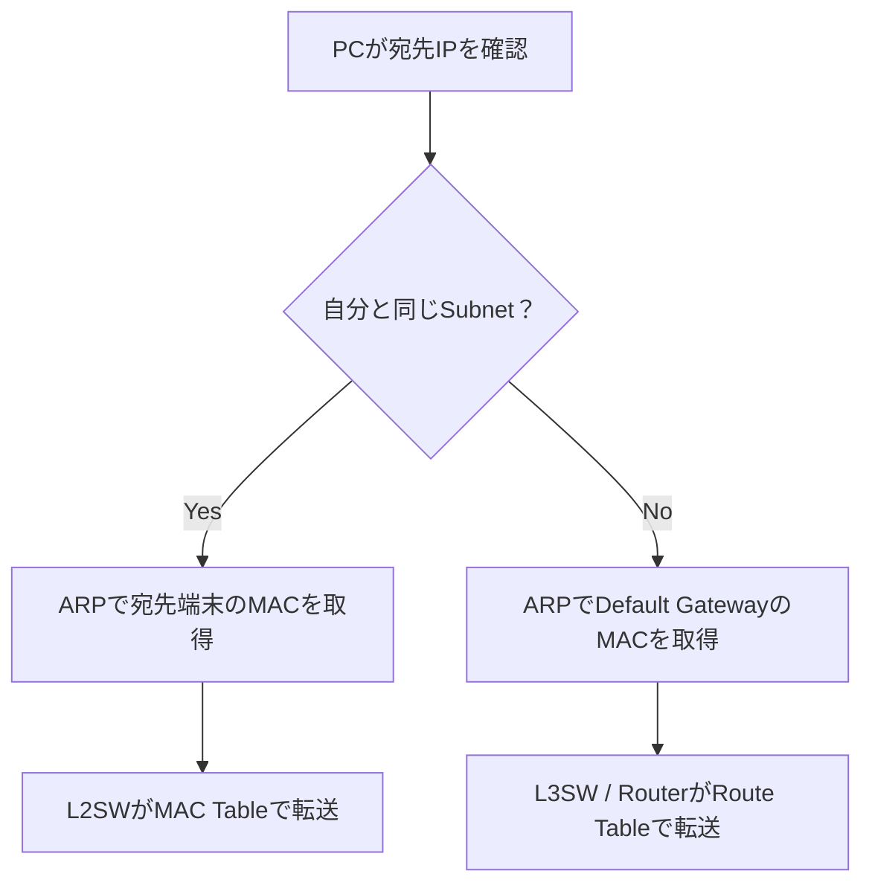

# ネットワーク運用保守・入場前チートシート 🛡️📡

確認日：2026-08-30  
目的：未経験〜経験浅めの担当者が、現場で会話・確認・切り分けについていけず足切りされることを防ぐ。

## この資料の使い方 🎯

- **毎日読む**：第0章、第13章、第19章、第22章
- **基礎を復習する**：第3〜12章
- **障害時に開く**：第13〜14章
- **AWS案件で開く**：第15章
- **入場直前に解く**：第21章
- **全部暗記する必要はない**。太字と⭐だけは、自分の言葉で説明できる状態を目指す

### 記号

- ✅ 事実・基本原則
- ⭐ 最低限の暗記事項
- ⚠️ 現場で誤解しやすい点
- 🧠 覚え方・例え
- 🛡️ 事故を防ぐ運用ルール
- 🧪 確認方法

---

# 0. 最初に叩き込む「15個の鉄則」🔥

1. **L2はMAC、L3はIP、L4はPort、L7はアプリの中身を見る。**
2. **同じSubnetなら宛先端末のMAC、別SubnetならDefault GatewayのMACへ送る。**
3. **VLANとSubnetは別物。ただし通常は1 VLAN＝1 Subnetで設計する。**
4. **Switchは送信元MACを学習し、宛先MACを見て転送する。**
5. **Router/L3SWは宛先IPとRoute Tableを見てNext Hopを決める。**
6. **Routeがあっても、FW・ACL・戻り経路・待受Portがなければ通信できない。**
7. **片道だけ確認して終わらない。戻り経路まで見る。**
8. **Ping成功＝ICMPが往復しただけ。業務アプリ正常ではない。**
9. **HostnameのPing成功＝名前解決は成功。ただしDNSを使ったとは限らない。**
10. **TCP/443失敗＝FW原因と断定しない。Route、待受、FW、戻り経路などを分ける。**
11. **ACCEPTログ＝アプリ正常ではない。Network上で許可された証拠にすぎない。**
12. **障害時は「事実」と「推測」を分け、発生時刻・範囲・直前変更を先に集める。**
13. **再起動・Clear・Shutdown・Firewall Flushを最初の一手にしない。証拠と通信を壊す。**
14. **変更前にBackup・Rollback・到達確認・作業対象を準備する。**
15. **分からなければ勝手に変更せず、確認結果を添えてEscalationする。**

---

# 1. AWS資格で活かせる部分／追加で必要な部分 ☁️➡️🏢

| そのまま活かせる ✅ | AWS資格だけでは不足しやすい ⚠️ |
|---|---|
| IP・CIDR・Subnet | 銅線・光・SFP・NICなどのL1 |
| Route Table・最長一致 | MAC・ARP・VLAN・Trunk・STP・LACP |
| DNS・DHCP・NAT | 物理SW・Router・FWのCLI |
| SG・NACL・通信許可/拒否 | Interface counter、CRC/FCS、Link flap |
| VPN・Direct Connect・TGW | Data Center、Rack、Power、配線、障害点 |
| Load Balancer・冗長化 | VMwareなどの仮想化基盤、On-prem Server |
| Flow Logs・CloudWatch | SNMP、syslog、NetFlow/IPFIX、Packet capture |
| AWS上の切り分け | 変更管理、Config backup、Rollback、Escalation |

🧠 **AWSは、城の中の通路をソフトウェアで見ていた状態。On-premでは床下の配線、門、交換機まで自分で見る。**

---

# 2. レイヤーの地図 🗺️

| 主な層 | 見るもの | 代表例 | 障害例 |
|---|---|---|---|
| L1 物理 | 電気・光・Link | Cable、SFP、NIC、Port | 抜線、断線、光量不足、Link down |
| L2 Data Link | MAC・Frame・VLAN | Ethernet、ARP、802.1Q、STP、LACP | VLAN違い、Loop、MAC未学習 |
| L3 Network | IP・Packet・Route | IPv4/IPv6、ICMP、OSPF、BGP | Routeなし、Gateway違い、重複CIDR |
| L4 Transport | Port・Session | TCP、UDP | Port閉鎖、RST、Timeout、再送 |
| L5〜L7 Application | 名前・暗号・内容 | DNS、DHCP、TLS、HTTP、Proxy | DNS失敗、証明書、HTTP 5xx |

⚠️ 現実の製品は複数Layerを処理します。FirewallはL3/L4中心ですが、NGFWはL7も解析します。TLSはL4とL7の間のように扱われることもあります。Layerは**切り分けの地図**として使います。

### データの呼び名

- L2：**Frame**
- L3：**Packet**
- TCP：**Segment**
- UDP：**Datagram**

⭐ **MACは同一L2区間、IPはNetwork間、PortはOS内のApplicationを識別する。**

---

# 3. L1：物理を最初に疑えるようにする 🔌【最優先】

## 最低限見るもの

| 状態・Counter | 意味 | よくある原因 |
|---|---|---|
| Administratively down | 設定でPort停止 | `shutdown`、運用上の閉塞 |
| Link down | 物理Link不成立 | Cable、SFP、NIC、相手電源、Port故障 |
| Link flap | Up/Downを反復 | 接触不良、光量、SFP、Auto-negotiation |
| CRC/FCS errors | 壊れたFrameを受信 | Cable、SFP、NIC、Duplex不一致 |
| Input/Output errors | 入出力処理の異常 | 物理、Buffer、Driver、機器問題 |
| Discards/Drops | Frame/Packetを破棄 | 輻輳、Queue不足、Policy、MTU |
| Speed/Duplex不一致 | 通信遅延・Error | 古い機器、手動設定ミス |
| Optical Rx/Tx power | 光の受信・送信強度 | Fiber汚れ、曲げ、距離、SFP不一致 |

⭐ **Link Upでも正常とは限らない。CRC・Drop・Flap・Speed/Duplexも見る。**

⚠️ Half-duplexは現代ではほぼLegacyですが、古い機器や設定不一致では遭遇します。

🛡️ Cableを抜き差しする前に、**Port番号、対向機器、冗長経路、影響範囲、作業承認**を確認します。

[Cisco：Switch PortとInterfaceの障害確認](https://www.cisco.com/c/en/us/support/docs/switches/catalyst-6500-series-switches/12027-53.html)・[Cisco：2026年のLatency/Packet Loss調査](https://www.cisco.com/c/en/us/support/docs/switches/catalyst-9300-series-switches/225617-troubleshooting-network-latency-and.html)

---

# 4. IPv4・CIDR・Subnet 🏠【最優先】

## `/24`とは

`192.168.10.0/24`は、IPv4の32bit中、先頭24bitがNetwork部という意味です。

- 全Address数：256
- 計算式：$2^{32-24}=256$
- 一般的なSubnet：Network addressとBroadcastを除き通常254 Host
- AWS Subnet：5 Address予約のため通常251個利用可能

⚠️ 「使える数＝必ず全体−2」ではありません。`/31` Point-to-PointやAWSなど例外があります。

## よく使うCIDR早見表

| Prefix | Address数 | 一般的な目安 |
|---:|---:|---:|
| /16 | 65,536 | 大きなNetwork |
| /24 | 256 | 一般的なLAN |
| /25 | 128 | /24の半分 |
| /26 | 64 | /24の1/4 |
| /27 | 32 | 小規模Segment |
| /28 | 16 | 小規模・AWS最小IPv4 Subnet |
| /29 | 8 | 非常に小さい区間 |
| /30 | 4 | 従来のPoint-to-Point |
| /31 | 2 | 対応機器でPoint-to-Point |
| /32 | 1 | 特定Host Route |

## 覚えるAddress範囲

| 範囲 | 用途 |
|---|---|
| `10.0.0.0/8` | Private IPv4 |
| `172.16.0.0/12` | Private IPv4 |
| `192.168.0.0/16` | Private IPv4 |
| `127.0.0.0/8` | Loopback。自分自身 |
| `169.254.0.0/16` | IPv4 Link-local。Windowsで見えたらDHCP失敗の手掛かりになることが多い |
| `224.0.0.0/4` | IPv4 Multicast |
| `0.0.0.0/0` | 全IPv4宛先。Default RouteのDestination |

⭐ 端末のDefault Gatewayは通常、その端末からL2で到達できる**同じSubnet内のAddress**にします。

## Public / Private Subnet

- Public Subnet：Route Tableに`0.0.0.0/0 → IGW`や`::/0 → IGW`など、IGWへの直接Routeがある
- Private Subnet：IGWへの直接Routeがない。必要に応じてNAT Gatewayなどを使用

⚠️ Public SubnetでもPublic IP/EIP・SG/NACL・正常なRouteがなければInternet通信はできません。

[AWS：Subnet sizing](https://docs.aws.amazon.com/vpc/latest/userguide/subnet-sizing.html)・[AWS：Public/Private Subnet](https://docs.aws.amazon.com/vpc/latest/userguide/VPC_Internet_Gateway.html)

---

# 5. L2：MAC・ARP・VLAN・Trunk 🏘️【最優先】

## Switchは何をしている？

1. 受信Frameの**送信元MAC**を見て「このMACはこのPort」と学習
2. **宛先MAC**をMAC Address Tableで検索
3. 該当Portへ転送
4. 未学習の宛先MAC、Broadcastは同じVLAN内へFlood

⭐ **ARP TableとMAC Address Tableは別物。**

- ARP Table：IPv4 ↔ MAC
- MAC Address Table：MAC＋VLAN ↔ Switch Port

どちらもCache/Tableであり、永続情報とは限りません。端末移動やGateway切替時には、Gratuitous ARPでIPとMACの対応変化を周囲へ通知することがあります。

⭐ Switchの各PortはCollision domainを分け、VLANはBroadcast domainを分けます。Hubは受信信号を全Portへ繰り返すLegacy機器で、Switchとは異なります。

[Cisco：MAC TableによるFrame転送](https://www.cisco.com/c/en/us/td/docs/switches/lan/c9000/lyr2-fwd/cdp-lldp-mac-udld/cdp-lldp-mac-udld-configuration-guide/configure-mac.html)

## VLANとSubnet

> ❌ VLAN＝Subnet  
> ✅ VLANはL2のBroadcast範囲、SubnetはL3のIP範囲

ただし通常は、管理しやすくするため**1 VLAN＝1 Subnet**にします。

| 用途 | VLAN | Subnet | Default Gateway例 |
|---|---:|---|---|
| 社員PC | 10 | `192.168.10.0/24` | `192.168.10.1` |
| Server | 20 | `192.168.20.0/24` | `192.168.20.1` |
| Guest Wi-Fi | 30 | `192.168.30.0/24` | `192.168.30.1` |
| Network管理 | 99 | `192.168.99.0/24` | `192.168.99.1` |

## 同じSubnet／別Subnetの通信



⭐ 別Subnet宛てのとき、送信元PCは遠隔ServerのMACをARPしません。**GatewayのMAC**を調べます。

- IPは原則End-to-Endで維持される
- MACはL3機器を越えるたびに張り替えられる
- NATがある場合はIP/Portも書き換わる

⚠️ 別VLANに同じIP Subnetを設定すると、Hostが「同じSubnet」と判断してARPしますが、ARP BroadcastはVLANを越えないため通信できません。通常は避けます。

## Access / Trunk / 802.1Q

| 用語 | 役割 |
|---|---|
| Access Port | 原則1 VLANをPCやPrinterへ渡す。通常Untagged |
| Trunk Port | 1 Linkで複数VLANを運ぶ |
| 802.1Q | FrameにVLAN IDなどのTagを付与 |
| 802.1X | LAN/Wi-Fiへ入る端末・利用者を認証。802.1Qとは別物 |
| Native VLAN | Trunk上のUntagged Frameを所属させるVLAN |
| Allowed VLAN | Trunkで通してよいVLAN一覧 |
| SVI | L3SW上のVLAN用仮想L3 Interface。Gatewayになることが多い |
| Inter-VLAN Routing | VLAN間をL3SW/RouterでRouteすること |

⚠️ Native VLAN不一致やAllowed VLAN漏れは、典型的な通信障害です。

⚠️ AP uplinkは、複数SSIDを別VLANへ割り当てる場合、Trunkになることがあります。

[Juniper：VLAN・Access・Trunk・Inter-VLAN Routing](https://www.juniper.net/documentation/us/en/software/junos/multicast-l2/topics/topic-map/bridging-and-vlans.html)

---

# 6. STP・LACP・Gateway冗長化 🔁【重要】

## STP / RSTP

L2に冗長Linkをそのまま作ると、Broadcastが回り続けて**Loop/Broadcast storm**になる危険があります。

- STP：Loopしないよう、冗長Portの一部をBlock
- RSTP：STPより高速に再収束
- Root Bridge：L2 Treeの基準となるSwitch
- BPDU：STP情報を交換するFrame
- PortFast：End device向けPortを早くForwardingへ
- BPDU Guard：End device向けPortでBPDUを受けたら停止し、誤接続Loopを防ぐ

⚠️ STPでPortがBlockingでも、必ずしも故障ではありません。**Loop防止の正常動作**の場合があります。

## LACP / Port-Channel

複数の物理Linkを1本の論理Linkにまとめます。

- 帯域を分散
- 1本故障しても残りで継続
- Flow単位のHashが一般的で、1通信が全Link帯域を合算できるとは限らない
- Member間でSpeed、VLAN、Trunk条件などを合わせる必要がある

通常のPort-Channelは1台の対向装置に接続します。2台の物理Switchを1台の論理Peerのように見せる方式は、MLAG、MC-LAG、vPCなど製品ごとに名称・動作が異なります。

## HSRP / VRRP

複数のL3機器で1つのVirtual IP/MACを持ち、Default Gatewayを冗長化します。

- HSRP：Cisco系
- VRRP：標準Protocol
- Active/Master障害時、Standby/Backupへ切替

⭐ **STP＝L2 Path、LACP＝Link束ね、HSRP/VRRP＝Default Gateway冗長化。**

⚠️ 2台あっても同じRack・電源・回線・上位SWを共有していれば、共通障害点が残ります。

[Cisco：STP障害とBroadcast storm](https://www.cisco.com/c/en/us/support/docs/lan-switching/spanning-tree-protocol/10556-16.html)・[Cisco：EtherChannelの負荷分散と冗長化](https://www.cisco.com/c/en/us/support/docs/lan-switching/etherchannel/12023-4.html)・[Cisco：HSRP](https://www.cisco.com/c/en/us/support/docs/ip/hot-standby-router-protocol-hsrp/10583-62.html)

---

# 7. L3：Route・OSPF・BGP・VRF 🛣️【最優先】

## Route Table

Routeは主に次の情報を持ちます。

- Destination Prefix：どこ宛てか
- Next Hop / Gateway：次に誰へ渡すか
- Outgoing Interface：どのInterfaceから出すか
- Metric / Preference：複数候補の優先度
- Source：Connected、Static、OSPF、BGPなど

## 最長一致

宛先`10.20.1.10`に対して、次が存在するとします。

- `10.20.0.0/16 → TGW`
- `0.0.0.0/0 → NAT GW`

より具体的な`/16`が選ばれるため、TGWへ進みます。

⭐ **Route選択は原則「最長一致」→ 同じPrefixならProtocol/Metricなどを比較。**

## 通信成立に必要なもの

1. 行きRoute
2. FW/ACL許可
3. 宛先でServiceがListen
4. 戻りRoute
5. 戻り側FW/ACL許可

⚠️ **片道Routeだけでは通信は成立しません。** Stateful Firewallを挟んだ非対称RouteはSession追跡に失敗することがあります。

## OSPF

- 1つのAS/管理Domain内部で使うIGP
- Link Stateを交換し、Costの小さいPathを計算
- NeighborがFullでも、必要RouteがRouting Tableへ入ったとは限らない

## BGP

- 主に異なるAS間のRoute交換
- AS_PATHやPolicyでPathを制御
- eBGP：異なるAS間
- iBGP：同じAS内部。大規模企業やData Centerでも利用
- `Established`でも、必要Prefixを受信・選択・広告できているとは限らない

⭐ **ProtocolがUp、Routeがある、実通信できる――この3つは別確認。**

## VRF

1台のRouter/L3SW内に、独立した複数のRoute Tableを持つ仕組みです。同じIP RangeでもVRFが別なら論理分離できます。

⚠️ `show ip route`だけでなく、対象VRFのRoute Tableを見る必要がある現場があります。

[Juniper：OSPF Overview](https://www.juniper.net/documentation/us/en/software/junos/ospf/topics/topic-map/ospf-overview.html)・[Juniper：BGP Overview](https://www.juniper.net/documentation/us/en/software/junos/bgp/topics/topic-map/bgp-overview.html)

---

# 8. TCP・UDP・Port・NAT・MTU 🚚【最優先】

## TCPとUDP

| TCP | UDP |
|---|---|
| 接続型 | Connectionless |
| 順序・再送・確認あり | TCPのような再送保証なし |
| Web、SSH、Mailなど | DNS、NTP、音声、映像などで多い |
| 信頼性重視 | 低遅延・軽量性重視 |

⚠️ DNSはUDPだけではありません。大きな応答やZone transferなどでTCP/53も使います。HTTP/3のQUICはUDPを使います。

## TCP 3-way Handshake

1. Client → `SYN`
2. Server → `SYN/ACK`
3. Client → `ACK`

- `RST`：接続拒否・強制Reset。Handshakeの通常3手には含まれない
- Timeout：Packet/Reply Drop、Route、FW、Congestionなどの可能性
- Connection refused/RST：Host到達後、待受なし・明示拒否などの可能性
- `ESTABLISHED`：TCP成立。Application正常までは保証しない

## Source Port

Clientは通常、一時的なHigh PortをSource Portとして使います。

`Client 10.0.0.10:53000 → Server 10.0.1.20:443`

戻りは`443 → 53000`です。Stateless ACL/NACLではEphemeral Portを考慮する必要があります。

## NAT/PAT

| 種類 | 意味 |
|---|---|
| SNAT | Source IPを書き換える。外向き通信で多い |
| DNAT | Destination IPを書き換える。公開Serverへの転送など |
| PAT/NAPT | IPに加えてPortも変換し、多数端末で1 Public IPを共有 |

⚠️ NATは暗号化でもFirewallでもありません。Address/Port変換が役割です。

## MTU

MTUは、1 LinkでFragmentせず送れる最大Data sizeです。

- 一般的なEthernet MTU：1500 bytes
- MTU不一致：一部の大きい通信だけ失敗、VPN経由だけ遅い、TLSで止まるなどの原因
- FragmentationやDrop、Path MTU Discovery失敗を確認
- ICMPを一律に遮断するとPath MTU Discoveryが壊れ、「小さいPacketだけ通る」障害を招くことがある

[Juniper：MTU Overview](https://www.juniper.net/documentation/us/en/software/junos/interfaces-fundamentals/topics/topic-map/media-mtu.html)

---

# 9. DNS・DHCP・TLS・HTTP・Proxy 🌐【最優先】

## DNS

DNSは「Domain → IP変換」だけではなく、**名前から各種Resource Recordを検索する仕組み**です。

| Record | 主な用途 |
|---|---|
| A | Name → IPv4 |
| AAAA | Name → IPv6 |
| CNAME | 別名 → 正式名 |
| PTR | IP → NameのReverse lookup |
| MX | Mail Server |
| SRV | ServiceのHost・Port。ADなどで重要 |
| TXT | 検証情報、SPFなど |

### DNS Serverの役割

- Authoritative：そのZoneの正解を保持する
- Recursive resolver：Clientに代わってRoot/TLD/Authoritativeへ問い合わせる
- Forwarder：Queryを別のDNS Serverへ転送する
- Split-horizon/Split DNS：同じNameへ、社内外など問い合わせ元に応じた異なる応答を返す

⭐ 「DNS Serverへ届く」だけでなく、**どのResolverへ聞き、どのZone/Forward Ruleが答えたか**を確認します。

### DNS失敗の見分け

- `NXDOMAIN`：名前が存在しない
- `SERVFAIL`：DNS Server側で処理失敗
- Timeout：DNS Serverまで届かない、応答が戻らないなど
- 古い結果：Cache/TTL、Dynamic DNS、複数Serverの不整合を確認

⚠️ `ping hostname`成功は名前解決成功ですが、DNS Cacheや`hosts`を使った可能性があります。DNS確認は`Resolve-DnsName`や`dig`で行います。

[Microsoft：DNS queryとCache](https://learn.microsoft.com/en-us/windows-server/networking/dns/queries-lookups)・[Microsoft：2026 DNS Troubleshooting](https://learn.microsoft.com/en-us/troubleshoot/windows-server/networking/troubleshoot-dns-guidance)

## DHCP

DHCPは、IP、Mask、Default Gateway、DNS ServerなどをLeaseします。

### DORA

1. Discover
2. Offer
3. Request
4. Acknowledge

最初のDiscoverはBroadcastです。DHCP Serverが別VLANにいる場合、L3機器の**DHCP Relay / IP helper**が必要です。

⚠️ `169.254.x.x`は、DHCPで取得できなかった手掛かりになることが多いです。ただしLink-localを意図的に使う場合もあります。

DHCP障害では、Scope枯渇、Lease、除外範囲、Reservation、Relay Address、Option（Gateway/DNS）、Server冗長状態も確認します。

[Microsoft：2026 DHCP TroubleshootingとDORA](https://learn.microsoft.com/en-us/troubleshoot/windows-server/networking/troubleshoot-dhcp-guidance)

## TLS/HTTPS

TCP/443成功後、TLSで次を確認します。

- Certificateの有効期限
- HostnameとSANの一致
- Certificate chain / CA trust
- Client/Serverの時刻
- TLS version / Cipher
- SNI
- ProxyによるTLS inspection

⚠️ `curl -k`はCertificate検証を無効化します。診断目的以外で常用しません。

## HTTP Status

- 2xx：Request成功
- 3xx：Redirect
- 4xx：Client Request、認証・権限など
- 5xx：Server/Upstream側

⚠️ HTTP 200でも内容が正しいとは限らず、HTTP 404/500でもNetwork接続自体は成功しています。

## Proxy

| 種類 | 位置・役割 |
|---|---|
| Forward Proxy | Client側の外向き通信を中継・制御 |
| Reverse Proxy | Server手前でRequestを受け、Backendへ中継 |

Proxy、NAT、LBは似ていますが別物です。

- NAT：Address/Port変換
- Proxy：Application通信を代理実行
- LB：複数Backendへ分配

---

# 10. 機器・Serviceの役割 🧰

典型構成：無線端末は`AP → Access SW`、有線端末はAccess SWへ直接接続し、その後`L3SW → Firewall → Edge Router/ISP → Internet`へ進みます。ただし役割統合やModern Fabricでは配置が異なります。

| 機器/Service | 主な役割 |
|---|---|
| AP | Wi-Fi端末をLANへ接続。L2 Bridgeとして動く部分が多い |
| WLC | AP、SSID、Channel、Roaming、Policyを集中管理 |
| Access SW | PC、AP、Phone、PrinterをVLANへ収容 |
| Distribution/Core L3SW | SW集約、Inter-VLAN Routing、Gateway |
| Router | WAN、他拠点、ISP、別NetworkへRoute |
| Firewall | IP/Port/Session/Applicationで許可・拒否。NAT/VPNを兼ねることもある |
| IDS/IPS | 攻撃を検知。IPSは通信をBlockingできる構成もある |
| WAF | HTTP/HTTPSを解析し、SQLi/XSSなどWeb攻撃を防ぐ |
| L4 LB | IP/Port/Connectionを基に分配 |
| L7 LB | Host、Path、HeaderなどApplication情報で分配 |
| Forward Proxy | Clientの外向き通信を代理 |
| Reverse Proxy | Serverの入口でBackendを代理 |
| RADIUS | Wi-Fi、LAN、VPNなどのAAA。802.1Xで多い |
| TACACS+ | Network機器管理者のAAA、Command認可で多い |
| NMS | SNMP、syslogなどを収集・監視 |

🧠 L2SW＝同じ部屋の内線係、L3SW＝社内の階をつなぐElevator、Router＝外へ出る高速道路、Firewall＝警備Gate。

⚠️ L3SWとRouterはどちらもRouteできます。違いは絶対ではなく、LAN内高速転送か、WAN/外部接続や多機能性かという**役割の傾向**です。

## Wireless障害の分解

1. APの電波を見つける
2. Association
3. 802.1X/PSKなどでAuthentication
4. DHCPでIP取得
5. Default Gatewayへ到達
6. DNS
7. Application

「Wi-Fiにつながらない」を一言で処理せず、どの段階かを分けます。RSSI、SNR、Channel干渉、AP収容数、Roamingも確認対象です。

---

# 11. Securityと通信制御 🔐

## ACL/FW Ruleを読む5点

1. Source IP
2. Destination IP
3. Protocol
4. Source/Destination Port
5. Action（Allow/Deny）

さらに、**方向、Rule順序、適用Interface/Zone、Stateful/Stateless、暗黙Deny**を確認します。

## Stateful / Stateless

- Stateful：許可したSessionの応答を自動認識
- Stateless：Inbound/Outboundをそれぞれ明示

⚠️ Statefulでも「Inboundを許可したら全Outbound通信も許可」ではありません。許可済みSessionの**応答**が対象です。

## AAA

- Authentication：誰か
- Authorization：何をしてよいか
- Accounting：何をしたか

RADIUSはNetwork access、TACACS+はNetwork機器管理でよく使いますが、完全な専用分けではありません。

## Management planeの基本

- SSH/HTTPSを使用
- SNMPは可能ならSNMPv3 AuthPriv
- Telnet、平文HTTP、SNMPv1/v2cはLegacy環境で残るが、新規設計では避ける
- 管理元IPを制限
- 管理Network/VRFを分離
- Shared accountを避け、AAA Accountingを残す
- Secret、Config、Packet captureをTicketやChatへ無加工で貼らない

[Cisco：SNMPv3のAuthentication/Encryption](https://www.cisco.com/c/en/us/support/docs/routers/xe-sd-wan-routers/222042-configure-snmpv3-on-catalyst-sd-wan.html)・[CISA：Network機器のAAA Accounting推奨](https://www.cisa.gov/news-events/cybersecurity-advisories/aa25-239a)

---

# 12. 監視・Log・性能指標 📈【最優先】

## 「Up/Down」以外に見るもの

| 指標 | 意味 |
|---|---|
| Availability | Up/Down、到達性 |
| Latency | 遅延 |
| Packet loss | 欠損率 |
| Jitter | 遅延の揺れ。音声/映像で重要 |
| Utilization | Link使用率 |
| Throughput | 実際に転送できた量 |
| Error | CRC/FCS、Input/Output error |
| Discard/Drop | Queue、Congestion、Policyなどで破棄 |
| TCP retransmission | ACKが返らず再送した可能性 |
| CPU/Memory | Control plane、Process負荷 |
| Temperature/Power/Fan | Hardware健全性 |

⭐ **Bandwidth＝道路の最大車線数、Throughput＝実際に通れた車の数。**

⚠️ 累積Counterが大きいだけでは障害と断定できません。**いつから、何秒でどれだけ増えたか**を見ることが重要です。

## Toolの役割

| Tool | 分かること | 分からないこと・注意 |
|---|---|---|
| SNMP Polling | CPU、Memory、帯域、Port状態 | 瞬間変化を取り逃す場合 |
| Trap/Inform | Link downなどの通知 | Trapは配送保証が弱い |
| syslog | Event、Login、Protocol変化、Error | 時刻同期がないと突合困難 |
| NetFlow/IPFIX | 誰が誰とどれだけ通信したか | 通常Payloadは見ない |
| Packet capture | Packetの詳細、Handshake、再送 | 取得位置で見えるTrafficが変わる。機密情報を含む |
| Streaming Telemetry/gNMI | 高頻度の状態/Counter | 対応機器・基盤が必要 |

### syslog Severity

`0 Emergency`が最重度、`7 Debug`が最軽度です。**数字が小さいほど重大**という点に注意します。Debugは大量出力やCPU負荷を招くことがあるため、本番で無断有効化しません。

### Packet captureの落とし穴

- Capture地点より手前でDropされたPacketは見えない
- SPAN/Mirror Port自体が輻輳し、複製Packetを落とすことがある
- Offloadや暗号化により、想定した形で見えないことがある
- 「見えない＝送信されていない」と即断せず、送信元・途中・受信側を比較する

## NTPが重要な理由

PC、Server、SW、FW、AWS Logの時刻がずれると、同一障害を時系列で追えません。

⭐ **Log調査の最初にTimezoneと時刻同期を確認する。**

[Juniper：System logging](https://www.juniper.net/documentation/us/en/software/junos/network-mgmt/topics/topic-map/system-logging.html)・[Cisco：SNMP TrapとSNMPv3](https://www.cisco.com/c/en/us/support/docs/ip/simple-network-management-protocol-snmp/13506-snmp-traps.html)

---

# 13. 障害切り分けの一本道 🚨【毎日読む】

## 最初の5問

1. **いつから？** 正確な時刻・Timezone
2. **誰が？** 1 User、1 VLAN、1拠点、全社
3. **何が？** Name resolution、Ping、TCP、HTTPS、Application
4. **どの方向？** Client→Server、Server→Client、両方向
5. **直前変更は？** Network、FW、Server、DNS、Certificate、Provider

## 確認順

1. Network図・通信経路を描く
2. 影響範囲を絞る
3. L1：Link、Cable、SFP、Error、Flap
4. L2：VLAN、Trunk、MAC、ARP、STP、LACP
5. L3：IP、Mask、Gateway、Route、VRF
6. 戻りRoute・非対称Path
7. FW/ACL/NAT/SG/NACL
8. DNS
9. TCP/UDP Port、Listener
10. TLS/Proxy/Certificate
11. Application/Server Log
12. Packet capture/Flow Logで仮説を確認

🛡️ Bottom-upは基本ですが、明確な症状があるなら効率よく絞ります。例えばIP指定でHTTPSが成功しName指定だけ失敗するなら、L1から全部やり直さずDNSへ寄せます。

## Testと分かること

| Test | 成功で分かること | 成功しても未確定 |
|---|---|---|
| Local IPへPing | Local TCP/IP stackの一部 | Cableや外部Network |
| GatewayへPing | ICMPでGatewayまで往復 | DNS、TCP、Application |
| 遠隔IPへPing | ICMPのEnd-to-End往復 | Port、TLS、Application |
| HostnameへPing | 何らかの名前解決＋ICMP | DNS Serverを使ったか、TCP |
| DNS query | DNS応答とRecord | 宛先Serviceの正常性 |
| TCP/443接続 | TCP Path、Listener/拒否状態の一部 | TLS、HTTP、Application |
| TLS成功 | Certificate/TLS negotiation | HTTP処理、Backend正常性 |
| HTTP 200 | Web Request成功 | Response内容の業務的正しさ |

## 症状 → 優先確認

| 症状 | 最初に見る候補 |
|---|---|
| LinkがDown | Cable、SFP、Power、Port shutdown、対向Port |
| IPが169.254.x.x | DHCP、VLAN、Relay、DHCP scope |
| 同一VLANだけ通信不可 | Host FW、ARP、MAC、Access VLAN、Duplicate IP |
| 同一VLANはOK、別VLAN不可 | Gateway/SVI、Inter-VLAN Route、ACL/FW |
| IP指定OK、Name指定NG | DNS、Cache、Suffix、Record |
| TCP Timeout | Route、FW Drop、戻りRoute、Service、Congestion |
| Connection refused/RST | Listenerなし、明示Reject、Service停止 |
| TCP OK、TLS NG | Certificate、Clock、SNI、TLS version、Proxy |
| 一部の大きい通信だけ失敗 | MTU、PMTUD、Fragmentation、VPN |
| 時々遅い/切れる | Error/Discard、Congestion、Flap、STP、LACP、Wi-Fi干渉 |
| 片方向だけ失敗 | 戻りRoute、ACL、Stateful FW、Asymmetric routing |
| 全体障害 | Core、Gateway redundancy、FW HA、Provider、共通DNS/DHCP |

## 報告Template

```text
【事象】何ができないか
【発生】YYYY-MM-DD HH:MM JST、継続/断続
【影響】User/端末/VLAN/拠点/Serviceの範囲
【通信】送信元IP → 宛先IP:Port / Protocol
【確認済み】Link、VLAN、ARP、Route、FW、DNS、Port等
【結果】Commandと重要な出力、正常比較
【直前変更】有/無/不明
【推測】事実と分けて記載
【依頼】確認してほしい機器・担当領域
```

[Microsoft：2026 TCP/IP Troubleshooting](https://learn.microsoft.com/en-us/troubleshoot/windows-server/networking/troubleshoot-tcp-ip-communication-guidance)

---

# 14. 最低限の確認Command ⌨️

## Windows / PowerShell

| 目的 | 推奨Command |
|---|---|
| IP・Gateway・DNS | `Get-NetIPConfiguration` / `ipconfig /all` |
| NIC状態 | `Get-NetAdapter` |
| Route | `Get-NetRoute` / `route print` |
| ARP/NDP | `Get-NetNeighbor` / `arp -a` |
| DNS | `Resolve-DnsName app.example.com` |
| ICMP | `ping <IP-or-name>` |
| Path | `tracert -d <IP>` |
| TCP Port | `Test-NetConnection <host> -Port 443` |
| Local TCP状態 | `Get-NetTCPConnection` / `netstat -ano` |
| HTTPS/TLS | `curl.exe -v https://app.example.com/` |

⚠️ `netstat`や`arp`は古いCommandですが、Legacy現場や手順書では現在も見ます。PowerShell cmdletも覚えます。

## Linux

| 目的 | 推奨Command |
|---|---|
| IP一覧 | `ip -br addr` |
| Link状態 | `ip -br link` |
| Route | `ip route` |
| 実際のRoute選択 | `ip route get <destination-ip>` |
| ARP/NDP | `ip neigh` |
| Listen/Connection | `ss -lntup` |
| DNS設定 | `resolvectl status` |
| DNS query | `resolvectl query <name>` / `dig <name>` |
| ICMP | `ping <IP-or-name>` |
| Path/MTU手掛かり | `tracepath <host>` |
| TCP Port | `nc -vz <host> 443` |
| HTTP/TLS | `curl -v https://<host>/` |
| NIC詳細 | `ethtool <interface>` |
| Network Log | `journalctl -u NetworkManager` |
| Packet capture | `sudo tcpdump -ni any host <IP> and port 443` |
| nftables | `sudo nft list ruleset` |

Modern Linuxでは`ip`、`ss`、`nftables`/`firewalld`が中心です。`ifconfig`、`route`、`netstat`、直接的な旧iptables運用はLegacy環境で遭遇します。

⚠️ `tcpdump`は権限と情報管理が必要です。認証情報や業務Dataが含まれる可能性があります。

## Cisco IOS系：まず覚えるRead-only確認

| 目的 | Command例 |
|---|---|
| L3 Interface概要 | `show ip interface brief` |
| Switch Port状態 | `show interfaces status` |
| Interface詳細 | `show interfaces <interface>` |
| Error counter | `show interfaces counters errors` |
| VLAN | `show vlan brief` |
| Trunk | `show interfaces trunk` |
| MAC Table | `show mac address-table` |
| ARP | `show ip arp` |
| Route | `show ip route` |
| STP | `show spanning-tree` |
| LACP/EtherChannel | `show etherchannel summary` |
| 隣接機器 | `show lldp neighbors detail` / `show cdp neighbors detail` |
| Log | `show logging` |
| 時刻 | `show clock` |
| CPU | `show processes cpu` |

## Junos系：対応する基本確認

| 目的 | Command例 |
|---|---|
| Interface概要 | `show interfaces terse` |
| Interface詳細/Error | `show interfaces extensive` |
| VLAN | `show vlans` |
| MAC Table | `show ethernet-switching table` |
| ARP | `show arp` |
| Route | `show route` |
| STP | `show spanning-tree interface` |
| LACP | `show lacp interfaces` |
| Log | `show log messages` |
| Alarm | `show system alarms` / `show chassis alarms` |

⚠️ Platform/Version/権限によりCommandが異なります。現場手順とVendor公式を優先します。

## 勝手に実行しないCommand 🚫

- `shutdown` / `no shutdown`
- `clear ...`
- `reload` / Reboot
- `write erase`
- `debug all`など高負荷Debug
- Firewall RuleのFlush
- Route、ARP、MAC、Sessionの強制Clear
- Productionでの無断Packet capture

🛡️ `show`系でも、`show tech-support`など大量出力・負荷・機密情報を含むものがあります。実行許可と保存先を確認します。

---

# 15. AWS Networkとの対応 ☁️

## On-premとの差

AWS VPCではL2が抽象化され、通常の利用者は物理Switch、VLAN、STP、ARPを直接管理しません。そのため、AWS資格だけではL1/L2の感覚が不足しやすくなります。

## AWS基礎

| 項目 | 最低限の理解 |
|---|---|
| VPC/Subnet | VPC CIDRをAZ単位のSubnetへ分割 |
| Route Table | DestinationとTarget。最長一致 |
| Public Subnet | IGWへの直接Routeあり |
| Private Subnet | IGWへの直接Routeなし。必要ならNAT GW |
| IGW | VPCとInternet間のRoute Target。IPv4 Public IPの変換にも関与。Firewallではない |
| SG | ENI/Resource単位、Allowのみ、Stateful |
| NACL | Subnetへの出入り、Allow/Deny、Rule番号順、Stateless |
| NAT GW | 主にPrivate Subnetの外向きIPv4。外部からの未要求接続は開始不可 |
| ALB/NLB | ALB=L7、NLB=L4 |

## VPC/Hybrid接続

| 方式 | 使い所 |
|---|---|
| VPC Peering | 少数VPCの1対1接続。Transitive routingなし。CIDR重複不可 |
| Transit Gateway | 多数VPC、VPN、DXのRegionalな中央Router。重複CIDR Route不可。Region間はTGW Peering等 |
| Site-to-Site VPN | On-premとVGW/TGWをIPsecで接続。通常2 Tunnel |
| Client VPN | Remote user端末からAWS/On-premへ接続 |
| Direct Connect | On-premからAWS Networkへの専用接続。VIF経由でVPC/TGWやPublic AWS Serviceへ接続。標準では暗号化なし |
| PrivateLink | VPC全体ではなく特定ServiceだけPrivate公開 |
| Interface Endpoint | Consumer VPCの選択SubnetにPrivate IP付きENIを作るPrivateLink入口 |
| Gateway Endpoint | S3/DynamoDBのみ。PrivateLinkを使わずRoute TableにPrefix List Route。Endpoint自体の時間・処理料金なし |

⚠️ Direct Connectを暗号化したい場合は、対応PortでのMACsecや、要件に応じたIPsec VPN併用などを設計します。「専用接続＝自動的に暗号化」ではありません。

⚠️ Interface EndpointのENIは**利用者側VPCで選んだSubnet**に作られます。提供側Resourceと同じSubnetへ作る、という意味ではありません。通常は時間・Data処理料金、SG、Private DNSも設計対象です。

⭐ PrivateLinkはNetwork全体をRouteしないためCIDR重複時にも利用しやすい一方、任意の相手IPへ自由に通信するVPC接続の代わりではありません。

## AWSの調査Tool

### VPC Flow Logs

- Source/Destination IP、Port、Protocol、Bytes、Packets、ACCEPT/REJECTなど
- NetFlow/IPFIXに近く、Packet Payloadは見ない
- ACCEPTでもWeb Application正常とは限らない
- REJECTだけでSG/NACLのどちらが原因か確定できない場合がある
- Real-time Packet captureではない

### Reachability Analyzer

- AWS設定を静的解析し、Source→Destinationの仮想PathとBlocking箇所を示す
- 実Packetを送るTestではない

### Route 53 Resolver

- Inbound：On-prem → AWSのDNSを問い合わせ
- Outbound：AWS → On-prem DNSへ問い合わせ
- **AWSから見たIN/OUT**で覚える

## AWS ↔ On-prem通信不能

### VPN

1. IKE
2. IPsec SA
3. Tunnel
4. BGP/Static Route
5. AWS Route Table / TGW Route Table
6. SG/NACL/On-prem FW
7. Server Listener/Application
8. Return Route

### Direct Connect

1. L1：Power、Port、Cross-connect、光
2. L2：VLAN、802.1Q、Peer IP
3. VIF
4. BGP
5. Advertised/Received Prefix
6. AWS/On-prem Route
7. FW/SG/NACL
8. Application/Return Route

[AWS：VPC Flow Logs](https://docs.aws.amazon.com/vpc/latest/userguide/flow-logs.html)・[AWS：Reachability Analyzer](https://docs.aws.amazon.com/vpc/latest/userguide/reachability-analyzer.html)・[AWS：Route 53 Resolver](https://docs.aws.amazon.com/Route53/latest/DeveloperGuide/resolver.html)・[AWS：VPN Troubleshooting](https://docs.aws.amazon.com/vpn/latest/s2svpn/Generic_Troubleshooting.html)・[AWS：Direct Connect L1/L2/Route Troubleshooting](https://docs.aws.amazon.com/directconnect/latest/UserGuide/Troubleshooting.html)

---

# 16. よく見るPort番号 🚪

| Port | Protocol/Service | 注意 |
|---:|---|---|
| 20/21 | FTP | 平文。Legacy |
| 22 | SSH/SFTP | Network機器・Linux管理 |
| 23 | Telnet | 平文。Legacy、新規利用は避ける |
| 49 TCP | TACACS+ | Network機器管理者のAAA |
| 25 | SMTP | Mail Server間など |
| 53 TCP/UDP | DNS | UDPだけではない |
| 67/68 UDP | DHCPv4 | Server/Client |
| 69 UDP | TFTP | 認証・暗号なし。機器ConfigでLegacy利用あり |
| 80 | HTTP | 平文 |
| 88 | Kerberos | AD認証で重要 |
| 123 UDP | NTP | 時刻同期 |
| 161/162 UDP | SNMP | Poll/Trap。可能ならv3 |
| 179 TCP | BGP | Peer間の経路交換 |
| 389 | LDAP | TLSなし/StartTLS構成に注意 |
| 443 TCP | HTTPS | HTTP/1.1・HTTP/2など |
| 443 UDP | QUIC/HTTP/3 | UDPもあり得る |
| 445 | SMB | Windows File共有/AD関連 |
| 500 UDP | IKE | IPsec VPN |
| 514 UDP/TCP | syslog | 実装・設計依存 |
| 636 | LDAPS | LDAP over TLS |
| 1812/1813 UDP | RADIUS | Authentication/Accounting |
| 3389 | RDP | Windows Remote Desktop |
| 4500 UDP | IPsec NAT-T | NAT越えVPN |
| 6514 TCP | syslog over TLS | 暗号化syslog |

⚠️ Port番号はConventionです。実際のServiceが別Portを使う場合もあるため、Configと[IANA Registry](https://www.iana.org/assignments/service-names-port-numbers)を確認します。

Port番号ではなく、IP Protocol番号で識別する代表例もあります。

| IP Protocol番号 | Protocol | 注意 |
|---:|---|---|
| 1 | ICMP | IPv4のError通知・診断。TCP/UDP Portなし |
| 47 | GRE | Tunnel。TCP/UDP Portなし |
| 50 | ESP | IPsec Data通信 |
| 51 | AH | IPsec Authentication Header |
| 89 | OSPF | TCP/UDPではない |
| 112 | VRRP | Gateway冗長化 |

---

# 17. IPv6で最低限固まらないための知識 6️⃣

- IPv6 Addressは128bit
- `::/0`：IPv6 Default Route
- `::1`：Loopback
- `fe80::/10`：Link-local
- IPv4のARPに相当する役割はNDP
- IPv6にはIPv4と同じBroadcastがなく、Multicastを活用
- SLAACやDHCPv6でAddress/設定を取得
- IPv6のDefault Routerは通常Router Advertisementで学習する
- IPv4/IPv6のDual Stackでは、どちらのAddressへ接続しているか確認
- ICMPv6はNDPやPath MTU Discoveryなどにも必要。一律遮断しない

⚠️ IPv4だけをTestして正常でも、ApplicationがIPv6を選びIPv6 Pathで失敗することがあります。

---

# 18. 現場で聞いても固まらない追加用語 🧩

ここはまず「一言で説明できる」ことを目標にします。案件で使うと分かってから、設定まで深掘りすれば十分です。

## 通信の届け方

| 用語 | 意味 | 運用で見る点 |
|---|---|---|
| Unicast | 1対1の通信 | 通常の端末・Server間通信 |
| Broadcast | 同じL2 Segment内の全員宛て | ARPやDHCP Discover。VLANを越えないのが基本 |
| Multicast | Group参加者だけに1対多で配信 | 映像配信、Routing Protocolなど。IGMP/PIM設計を確認 |

## TTL / Hop Limitとtraceroute

- IPv4の`TTL`、IPv6の`Hop Limit`は、L3機器を1台通るたびに1減る
- 0になるとRouterが破棄し、通常はICMP Time Exceededを返す
- `traceroute` / `tracert`はこの仕組みを使い、Hopごとの応答を表示する
- 途中Hopが`*`でも、その機器がICMPへ応答しないだけで、以降へ転送できている場合がある

⭐ **tracerouteの星印だけで「そのHopが故障」と断定しない。** 最終宛先への到達性、往復経路、Firewall/ACLも合わせて判断します。

## LLDP / CDP

- `LLDP`：Vendor中立の隣接機器発見Protocol
- `CDP`：Cisco独自の隣接機器発見Protocol
- 「どのPortの先に、どのSwitch/AP/Phoneがいるか」を調べる手掛かり
- 未信頼Portで公開すると機器情報が漏れるため、利用範囲は現場Policyに従う

## PoE

`PoE`はEthernet CableでDataと電力を送り、AP、IP Phone、Cameraなどへ給電します。

LinkやVLANだけでなく、次も確認します。

- Switch全体のPoE Power Budget
- Portごとの供給状態・Class・消費電力
- `power denied`、過電流、対応規格Mismatch
- Cable品質・長さ、端末側のPoE対応

⭐ 「APが起動しない」はNetwork設定ではなく、PoE不足の場合があります。

## QoS

`QoS`は、混雑時に重要Trafficを優先しやすくする仕組みです。**帯域そのものを増やす魔法ではありません。**

1. Classify：Voice、業務、Backupなどを分類
2. Mark：DSCPなどの印を付ける
3. Queue/Schedule：どのQueueから優先して送るか決める
4. Police/Shape：Rateを制御する

| 機能 | 超簡潔な違い |
|---|---|
| Policing | 超過TrafficをDropまたはRemark。遅延は増やしにくいがLossが出やすい |
| Shaping | 超過TrafficをBufferして平準化。Lossを抑えやすいが待ち時間が増える |

混雑、Drop、Queue、DSCPが**経路の途中で維持されているか**を見ます。

[Cisco：PolicingとShaping](https://www.cisco.com/c/en/us/support/docs/quality-of-service-qos/qos-policing/19645-policevsshape.html)・[Cisco：DSCP](https://www.cisco.com/c/en/us/support/docs/quality-of-service-qos/qos-packet-marking/10103-dscpvalues.html)・[Cisco：LLDP/CDPと隣接情報](https://www.cisco.com/c/en/us/support/docs/ip/access-lists/13608-21.html)

## Network機器の3つのPlane

| Plane | 役割 | 障害例 |
|---|---|---|
| Data/Forwarding Plane | 実Packetを転送 | ASIC/Interface/QueueのDrop |
| Control Plane | RouteやTopologyを学習・計算 | OSPF/BGP/STPのNeighbor異常、CPU高騰 |
| Management Plane | 管理者・監視が操作/収集 | SSH、SNMP、syslog、NTP到達不能 |

⭐ SSHできないからといってData通信も止まっているとは限らず、逆も同じです。

## Tunnel・WAN・Data Center用語

| 用語 | 最低限の理解 |
|---|---|
| Underlay | 実際にPacketを運ぶ土台のIP Network |
| Overlay | Underlay上に論理的に作るNetwork/Tunnel |
| GRE | IP Packetを別のIP Packetへ包むTunnel。**単体では暗号化しない** |
| IPsec | IP通信を暗号化・認証する仕組み。Site-to-Site VPNで利用 |
| MPLS | Labelを使ってProvider/Core網内で転送する技術。L3VPNなどに利用 |
| SD-WAN | 複数WAN回線を一元Policyで選択・制御するArchitecture |
| VXLAN | VNIでL2 SegmentをL3 IP Network上へ延伸するOverlay技術 |
| EVPN | MAC/IP到達情報をBGPで交換するControl Plane。VXLAN/MPLSと組み合わせることが多い |
| ECMP | 同じCostの複数経路を併用する仕組み |
| BFD | 隣接経路の生存を高速検知し、OSPF/BGPなどの収束を助ける仕組み |

⚠️ VXLANやMPLSを見ても、最初から内部をすべて設定できる必要はありません。まず、**Underlayが落ちればOverlayも影響する／Tunnelの外側と内側を分けて調べる**と理解します。

[Juniper：EVPN-VXLANのUnderlay/Overlay](https://www.juniper.net/documentation/us/en/software/junos/evpn/topics/topic-map/vxlan-ipv6-underlay-overview.html)・[Juniper：EVPN-VXLAN Encapsulation](https://www.juniper.net/documentation/us/en/software/junos/evpn/topics/concept/evpn-vxlan-data-plane-encapsulation.html)

---

# 19. 障害対応・変更作業で事故らない 🛡️【毎日読む】

## 運用で使う言葉

| 用語 | 意味 |
|---|---|
| Event | 機器やServiceで起きた状態変化。正常な変化も含む |
| Alert | 監視条件に一致し、人の確認を促す通知。障害確定とは限らない |
| Incident | Serviceへの影響を早く復旧させる対象 |
| Problem | Incidentの根本原因・再発傾向を調べる対象 |
| Change | 承認・手順・Rollbackを伴う管理された変更 |
| Severity | 影響範囲や緊急度に基づく重大度。技術的な難しさとは別 |

⭐ Incident対応の第一目的は**安全なService復旧**です。恒久原因の追究は証拠を保全しつつ、Problem管理として継続する場合があります。

## 障害時

1. 監視Alertを鵜呑みにせず、実Impactを確認
2. 発生時刻・範囲・通信情報を固定
3. Network図と経路を確認
4. 直前変更を確認
5. Read-only情報を採取
6. 正常系と比較
7. 仮説を1つずつ検証
8. 必要なら影響を抑えるContainment
9. 復旧確認
10. 原因・再発防止・手順改善を残す

## 変更前

- Ticket/承認番号
- 目的と対象Device/Interface
- 現在Configと状態
- Config Backup/Diff
- 想定影響と停止時間
- 作業手順
- Rollback手順・発動条件
- Console/OOBなど、管理接続喪失時の手段
- 監視抑止・関係者連絡
- Before Test結果

## 変更中

- 1変更ずつ
- 時刻とCommandを記録
- 想定外なら止める
- その場の思いつきで追加変更しない
- Peer/Reviewerと相互確認

## 変更後

- Interface、Neighbor、Route、HA状態
- End-to-End通信
- Application Test
- Error/Drop/CPU/Log
- Monitoring復帰
- Config保存/Backup
- Ticket更新と関係者連絡

🛡️ Junosの`commit confirmed`やCisco系のConfirmed Rollbackなど、自動Rollback機能が使える場合は現場標準に従って活用します。

[Juniper：commit confirmedと自動Rollback](https://www.juniper.net/documentation/us/en/software/junos/cli/topics/topic-map/junos-configuration-commit.html)・[Cisco：Configuration Rollback Confirmed Change](https://www.cisco.com/c/en/us/td/docs/routers/ios-xe/system-management/system-management/m_cm-config-rollback-confirmed-change.html)・[NIST SP 800-61r3：2025 Incident Response](https://csrc.nist.gov/pubs/sp/800/61/r3/final)

---

# 20. 入場初日に確認すること 📝

- 最新Network構成図はどこか
- IP Address管理表、VLAN表、Rack/配線表はどこか
- Device一覧、Vendor、Model、OS Version
- L2/L3境界と各VLANのDefault Gateway
- STP Root、HSRP/VRRP Active、LACP構成
- OSPF/BGP Neighbor、AS番号、主要Route
- Internet、WAN、VPN、DXの回線事業者と責任分界点
- Firewall Rule/NATの管理担当
- DNS/DHCP/RADIUS/NTP/SNMP/syslogのServer
- Monitoring ToolとAlert閾値
- Normal時のBaseline
- Config Backupの場所と復旧方法
- Read-only AccountとPrivileged操作の申請方法
- 障害Severity、連絡網、Escalation先
- Change申請、Maintenance window、Rollback基準
- Packet capture/Log持ち出しのRule
- よくある障害と既知Problem

⭐ 分からないことを隠すより、**どの資料を見て、誰へ確認すべきか知ること**が運用では重要です。

---

# 21. 最終理解度チェック ✅

次を1〜2文で説明できれば、入場前の最低線にかなり近づいています。答えを暗記するより、**なぜそう判断するか**を声に出してください。

1. VLANとSubnetはなぜ同じではない？
2. 同じSubnet宛てと別Subnet宛てで、ARP対象はどう変わる？
3. ARP TableとMAC Address Tableの違いは？
4. Access PortとTrunk Portの違いは？
5. Native VLAN mismatchで何が起こり得る？
6. STPはなぜPortをBlockする？
7. LACPは何を束ね、何を保証しない？
8. HSRP/VRRPは何を冗長化する？
9. CRC/FCS Errorが増えたら何を疑う？
10. `/24`のAddress数はいくつ？AWSで通常いくつ利用可能？
11. `0.0.0.0/0`はDestinationかNext Hopか？
12. 最長一致とは？
13. 行きRouteがあっても通信できない理由を5つ挙げられる？
14. OSPF Neighbor FullとApplication通信成功は同じか？
15. BGP Established後に何を追加確認する？
16. StatefulとStatelessの違いは？
17. TCP TimeoutとRSTで、疑う方向はどう違う？
18. TCP/443成功後にHTTPSが失敗する原因は？
19. DNSのA、AAAA、CNAME、PTR、SRVは何？
20. DHCP DORAとRelayは何？
21. SNAT、DNAT、PATの違いは？
22. Packet loss、Latency、Jitter、Utilizationの違いは？
23. Ping成功で何が分かり、何が分からない？
24. VPC Flow LogsのACCEPTで何が分かり、何が分からない？
25. Reachability Analyzerは実Packetを送るか？
26. PrivateLinkとVPC Peeringの違いは？
27. Gateway Endpointは何に使え、PrivateLinkを使うか？
28. VPNとDirect Connectの暗号化・経路の違いは？
29. 障害時の最初の5問は？
30. 変更前にBackupとRollback以外に何を準備する？
31. LLDP/CDPから何が分かり、利用時に何へ注意する？
32. PolicingとShapingは、超過Trafficをどう扱う？
33. Management Planeに入れないと、Data Planeも停止したと言える？
34. GREとIPsecの最も重要な違いは？
35. Underlay障害がOverlayへ影響する理由は？

## 採点方法

- 自分の言葉で理由まで説明できる：1点
- 用語は分かるが理由・確認方法が曖昧：0.5点
- 説明できない／逆に覚えている：0点

| 得点 | 復習の目安 |
|---:|---|
| 32〜35 | 基礎はかなり安定。現場固有の構成・手順へ進む |
| 28〜31.5 | 最低線は近い。0点の章を優先して読み直す |
| 23〜27.5 | 足切りRiskあり。第3〜15章を実機/Commandと結び付ける |
| 0〜22.5 | 用語暗記より、同じ/別Subnet通信と障害切り分けからやり直す |

⚠️ これは学習用の目安で、案件ごとの合格保証ではありません。CLI権限、製品、運用手順は現場ごとに別確認します。

## 答え合わせ用の要点

| # | 最低限含めたい答え |
|---:|---|
| 1 | VLANはL2のBroadcast範囲、SubnetはL3のIP範囲。1対1は一般的な設計慣行で同義ではない |
| 2 | 同一Subnetは宛先Host、別SubnetはDefault GatewayのMACをARPで調べる |
| 3 | ARP TableはIP↔MAC、SwitchのMAC TableはMAC＋VLAN↔Port |
| 4 | Accessは原則1 VLANをUntaggedで収容、Trunkは複数VLANを802.1Q Tagで運ぶ |
| 5 | Untagged Frameを誤ったVLANへ所属させ、通信断や意図しない接続を起こし得る |
| 6 | 冗長L2 LinkによるLoop、Broadcast storm、MAC flappingを防ぐため |
| 7 | 複数Linkを論理的に束ねる。1 Flowが合計帯域を使えることや、経路全体の冗長性は保証しない |
| 8 | 端末が使うDefault GatewayのVirtual IP/MACを複数L3機器で冗長化する |
| 9 | Cable、SFP、NIC、光量、接触、Speed/DuplexなどL1を優先確認する |
| 10 | 256 Address。AWS IPv4 Subnetでは5個予約され、通常251個利用可能 |
| 11 | 全IPv4宛先に一致するDestination。Next Hop/Targetではない |
| 12 | 宛先に一致するRouteのうち、Prefix長が最も長い具体的なRouteを選ぶこと |
| 13 | 例：FW/ACL、戻りRoute、NAT、宛先Listener/Application、MTU。DNSはName利用時に追加確認 |
| 14 | 同じではない。Neighbor正常後もRoute、FW、戻り、Port、Applicationを確認する |
| 15 | 必要Prefixの受信、Policy、Best path、Routing TableへのInstall、Next hop、相手への広告を確認する |
| 16 | Statefulは許可Sessionの応答を追跡、Statelessは往復方向を個別に許可する |
| 17 | TimeoutはDrop/Route/戻り/輻輳など。RSTは到達後の待受なし・明示拒否などが候補 |
| 18 | Certificate期限/SAN/Chain、Clock、SNI、TLS Version/Cipher、Proxyなど |
| 19 | A=IPv4、AAAA=IPv6、CNAME=別名、PTR=逆引き、SRV=ServiceのHost/Port |
| 20 | Discover→Offer→Request→Acknowledge。Relayは別VLANのDHCP Serverへ中継する |
| 21 | SNATは送信元、DNATは宛先、PATはIPに加えてPortも変換する |
| 22 | Loss=欠損、Latency=遅延、Jitter=遅延の揺れ、Utilization=Link使用率 |
| 23 | ICMPが往復したこと。DNS、TCP Port、TLS、Applicationの正常までは分からない |
| 24 | FlowがNetwork制御上許可されたこと。Serverの待受やApplication正常は分からない |
| 25 | 送らない。AWS設定をModel解析してPathとBlock箇所を調べる |
| 26 | PeeringはVPC Network同士、PrivateLinkはConsumerから特定ServiceだけをPrivate利用する |
| 27 | S3/DynamoDB用。PrivateLinkではなく、Route TableへPrefix List Routeを追加する方式 |
| 28 | VPNはIPsec暗号Tunnelを通常Internet上に作る。DXは専用接続だが標準では暗号化されない |
| 29 | いつから、誰/範囲、何が、どの方向、直前変更 |
| 30 | 承認、対象、影響、作業/検証手順、連絡、OOB/Console、Rollback発動条件など |
| 31 | 直結Neighbor、Port、機種等の情報。未信頼Portへの情報公開と現場Policyに注意する |
| 32 | Policingは超過分をDrop/Remark、ShapingはBufferして遅らせ平準化する |
| 33 | 言えない。管理・制御・転送Planeは関連するが、片方だけの障害もある |
| 34 | GREは包むだけで単体暗号化なし。IPsecは通信を暗号化・認証する |
| 35 | Overlay PacketはUnderlayのIP到達性を使って運ばれるため |

---

# 22. 1分で読み返す最終まとめ ⚡

> 🔌 L1：Link、Cable、SFP、Error、Flap  
> 🟦 L2：MAC、ARP、VLAN、Trunk、STP、LACP  
> 🟩 L3：IP、CIDR、Gateway、Route、OSPF、BGP  
> 🟨 L4：TCP/UDP、Port、Session、RST/Timeout  
> 🟥 L7：DNS、DHCP、TLS、HTTP、Proxy  
> 👮 制御：ACL/FW/NAT、方向、Rule順、戻り通信  
> 📈 監視：Availability、Latency、Loss、Jitter、Utilization、Error  
> 🧩 補助：LLDP/CDP、PoE、QoS、TTL、Underlay/Overlay  
> 🧪 切り分け：範囲 → Path → Layer → Return → Evidence  
> 🛡️ 運用：事実と推測を分け、変更前Backup、Rollback、承認  

## 本当に重要な一文

> **SourceからDestinationまでの行きと戻りを、L1 → L2 → L3 → L4 → L7の順に、事実とLogで追跡する。勝手に変更せず、証拠を添えて連携する。**

---

# 参考資料と古い規格の扱い 📚

本文は2026-08-30時点で、AWS、Microsoft、Cisco、Juniper、NIST、CISA、IANAの公式資料を確認しています。

2024年より前に公開された次の基礎規格も参照対象です。公開日は古いものの、現行Networkの基礎仕様として使われています。

- [RFC 826：ARP（1982）](https://www.rfc-editor.org/rfc/rfc826.html)
- [RFC 1918：Private IPv4（1996）](https://www.rfc-editor.org/rfc/rfc1918.html)
- [RFC 4861：IPv6 Neighbor Discovery（2007）](https://www.rfc-editor.org/rfc/rfc4861.html)
- [RFC 8200：IPv6（2017）](https://www.rfc-editor.org/rfc/rfc8200.html)
- [RFC 9293：TCP（2022、RFC 793を置換）](https://www.rfc-editor.org/rfc/rfc9293.html)

Legacyとして特に注意するもの：Telnet、平文HTTP管理、FTP/TFTP、SNMPv1/v2c、古い`ifconfig`/`route`/`netstat`中心の手順、旧来の直接iptables運用。既存環境では残るため読める必要がありますが、新規運用ではSSH/HTTPS、SNMPv3、`ip`/`ss`、nftables/firewalldなどを優先します。
