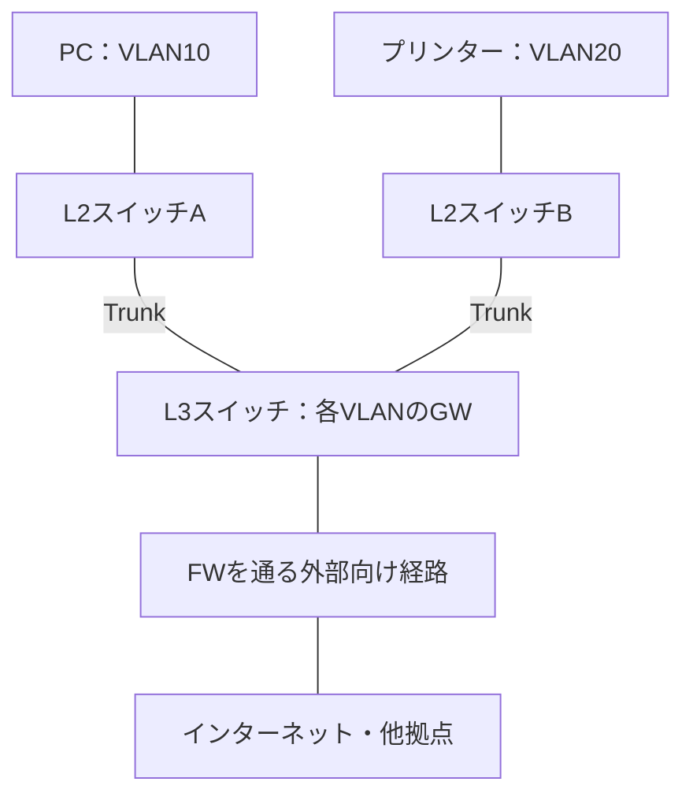

# NW運用保守｜L2・L3・FWをつなげて学ぶ2〜3時間チートシート

公式資料の確認日：2026-09-12／対象：Cisco中心、OpManager、Cato、Tera Termを使う現場への参画準備

## 🎯 今日のゴール

**「どこが怪しいかを、安全に確認して、根拠を添えて相談できる」こと。**

覚える柱は3つです。L2は「同じVLAN内で届ける」、L3は「別ネットワークへの道を選ぶ」、FWは「その通信を通してよいか決める」。

ここでいう「必須ライン」は、面談で出たログ確認・VLAN変更・FW変更に向けた学習上の目安です。実際の担当範囲や変更権限は現場で確認します。本番変更は手順書・承認・レビューのもとで行います。

### 2時間の使い方

| 時間 | 学ぶこと | 最低限できるようになること |
|---|---|---|
| 0〜15分 | 全体像・IPの基本 | L2・L3・FWの役割を分けて説明する |
| 15〜45分 | L2 | 対象ポート、VLAN、上位リンクを確認する |
| 45〜75分 | L3 | GW・宛先への経路・戻り道を確認する |
| 75〜100分 | FW | 許可する通信の条件と、ログの見方を説明する |
| 100〜120分 | 運用の流れ | 監視・調査・証拠・変更・報告をつなげる |
| 追加30〜60分 | 3つの練習 | 見ずに説明し、迷ったところだけ復習する |

各章を読んだら「必須ライン」を自分の言葉で説明してください。コマンドのつづりは見ながらで構いません。

---

## ① 🗺️ 最初に、通信の全体像｜15分

### 3つの役割

| 役割 | やさしくいうと | 業務で考えること |
|---|---|---|
| L2 | 同じグループの中で届ける | ケーブルはつながる？ 正しいVLAN？ |
| L3 | 別グループへ行く道を選ぶ | GWは正しい？ 宛先への経路はある？ |
| FW | 通してよい通信か決める | この送信元・宛先・サービスは許可されている？ |

**「道がある」と「通行を許可されている」は、別の条件です。**

L2・L3は通信の層、FWは通信を検査・制御する機能や製品です。FWはL3/L4に加えてアプリの内容を見るものもあります。L2・L3・FWは、必ず1台ずつ決まった順に並ぶわけではありません。

### 学習用の構成例

以下は理解のための例で、実際の現場構成が確定した図ではありません。

この例では、PCからプリンターへの通信はL3スイッチでVLAN間を渡ります。図の外部向けFWは通りません。**FWは、自分を通る通信を検査します。**

実際にはFWがVLANのGWになる構成もあります。L3スイッチもルーターも経路を選びます。社内LANでL3スイッチ、WAN接続でルーターを使う例は多いですが、役割・機能・構成で決まります。[Cisco公式：VLAN間の通信](https://www.cisco.com/c/en/us/td/docs/switches/lan/catalyst9300/software/release/17-18/configuration_guide/rtng/b_1718_rtng_9300_cg/configuring_ip_unicast_routing.html)

### IPの基本は、この4つ

| 言葉 | 意味 |
|---|---|
| IP | 通信相手を指定する住所 |
| サブネットマスク／CIDR | どこまでが同じ住所グループかを示すもの |
| デフォルトGW | ほかに適切な経路がないときの基本の渡し先 |
| ポート番号 | その相手の、どのサービスへ接続するかを示す番号 |

「スイッチのポート」は物理的な差込口、「TCP/UDPのポート」はサービスを区別する番号です。同じ言葉ですが別物です。

PCが `192.168.10.20/24` の場合：

| 宛先 | 判断 |
|---|---|
| `192.168.10.80` | 同じサブネット。通常、相手へ直接届ける |
| `192.168.20.80` | 別サブネット。通常、GWへ渡す |

`/24` は `255.255.255.0`。この例では `.0〜.255` の256アドレスが同じサブネットで、端末用は通常 `.1〜.254` の254個です。

**「先頭3つの数字が同じなら同じサブネット」は、/24の例に限った見方です。** /25などでは範囲が変わります。例えば `192.168.10.0/25` は `.0〜.127` なので、`.20` と `.200` は同じ範囲に入りません。

✅ **必須ライン：自分と相手が同じサブネットか、GWが必要かを、マスクと合わせて判断できる。**

---

## ② 🔀 L2：同じVLANの中で届ける｜30分

### 何を理解する？

| 言葉 | ひと言で | どんな場面で使う？ |
|---|---|---|
| MACアドレス | LAN内で届け先を識別するアドレス | 端末がどのポートにつながるか探す |
| MACアドレステーブル | スイッチが学習した、VLAN・MAC・ポートの対応 | 対象端末の接続場所を追う |
| VLAN | 物理的なスイッチ内・スイッチ間のLANを、論理的に分ける | 部署・サーバー・プリンターなどを分ける |
| Access | 通常、1つのデータ用VLANを端末へ渡すポート | PC・プリンターの接続 |
| Trunk | 複数VLANの通信を区別してまとめて運ぶポート | スイッチ間、AP、仮想化ホストなどの接続 |
| 802.1Q | フレームにVLAN番号の目印を付ける標準方式 | TrunkのVLANを区別する |
| STP | 通信が輪になって回り続けるループを防ぐ | 冗長なスイッチ接続の状態確認 |

Accessは「相手1台とだけ通信するポート」ではありません。VLANや経路で許される複数の相手と通信できます。

Trunkは複数VLANを運びますが、**VLAN間の通信を可能にするのはL3の役割**です。通常のTrunkではタグを使いますが、タグなしで扱うnative VLANもあるため、「Trunkは全てタグ付き」とは覚えません。

### VLANとサブネットの違い

- **VLAN**：L2の通信グループを分ける。
- **サブネット**：IPの範囲を分ける。
- 通常は、1つのVLANに1つのサブネットを対応させます。
- 1台のスイッチで複数VLANを扱えます。同じVLANを複数スイッチにまたがせることもできます。

同じIP範囲を設定しただけでは、別VLANの端末が普通に直接通信できるようにはなりません。[Cisco公式：VLAN](https://www.cisco.com/c/en/us/td/docs/switches/lan/catalyst9300/software/release/17-18/command_reference/b_1718_9300_cr/vlan_commands.html)

### ARPは「MACを調べる下準備」

IPv4でEthernet上に送るとき、ARPで「渡し先のIPに対応するMAC」を調べます。

| 通信先 | 通常、最初に調べるMAC |
|---|---|
| 同じサブネットの相手 | 相手のMAC |
| 別サブネットの相手 | 渡し先GWのMAC |

**ARPだけでデータ通信が完結するわけではありません。** ARPは届け先MACの下調べで、その後に実際のデータを送ります。[Cisco公式：アドレス解決](https://www.cisco.com/c/en/us/td/docs/switches/lan/catalyst9300/software/release/17-18/configuration_guide/rtng/b_1718_rtng_9300_cg/configuring_ip_unicast_routing.html)

### 業務例：「このプリンターだけ使えない」

1. 対象端末とポートを、機器台帳・MACテーブルなどで特定。
2. ケーブル・端末電源・リンク状態を確認。
3. ポートのAccess VLANが正しいか確認。
4. 必要な上位リンクで、対象VLANを運べるか確認。
5. MAC学習・エラー・同じ時刻のログを確認。

| 表示 | どう考える？ |
|---|---|
| `connected`／リンクUp | 物理接続がある。印刷できる保証まではない |
| `notconnect`／リンクDown | ケーブル・相手の電源などを確認。原因はまだ確定しない |
| `administratively down` | 設定上、止められている |
| `err-disabled` | 保護機能などで無効化。理由を確認してから対応する |
| CRCなどのエラー増加 | ケーブルなどの物理系も調べる。数字だけで原因確定はしない |
| STPのBlocking／Discarding | ループ防止のため、正常に止めている場合がある |

**STPの停止経路を、勝手に通さないこと。** 通信を守るために止めている可能性があります。[Cisco公式：STP](https://www.cisco.com/c/en/us/td/docs/switches/lan/catalyst9300/software/release/17-18/configuration_guide/lyr2/b_1718_lyr2_9300_cg/configuring_spanning_tree_protocol.html)

### VLAN変更で必ず考えること

「VLAN20から30へ変更する」なら、ポートの番号だけを変えれば完了、ではありません。

- 対象ポートは本当に合っている？
- VLAN30は存在し、必要なTrunkで許可・転送されている？
- 端末の固定IP・マスク・GW、またはDHCPの準備は？
- GW・往復の経路・FW/ACLは必要な通信を通せる？
- 変更後の印刷・業務確認と、戻し方は決まっている？

**VLAN変更で固定IPは自動変更されません。** AP・仮想化ホスト・上位リンクは、1ポートの変更が多数の端末・VMに影響する場合があります。Trunkの許可VLANも「追加」と「一覧の置換」の違いに注意します。

✅ **必須ライン：対象ポートを特定し、リンク・VLAN・Trunkを確認できる。VLAN変更が端末IPや上位経路にも関係すると説明できる。**

---

## ③ 🛣️ L3：別ネットワークへの道を選ぶ｜30分

### 何を理解する？

| 言葉 | ひと言で | どんな場面で使う？ |
|---|---|---|
| GW | 別ネットワークへ通信を渡す相手 | 別VLANや外部につながらないとき |
| SVI | スイッチ上の、VLAN用の仮想IPインターフェース | VLANのGWのIP・状態を確認するとき |
| ルーティング | 宛先IPに合った経路を選ぶこと | 別ネットワークへ通信するとき |
| 経路表 | 宛先ネットワークごとの行き先一覧 | 「この機器は相手への道を知っている？」を調べる |
| Next hop | 次に渡す機器のIP | 次の調査対象を判断するとき |
| 戻りの経路 | 相手から送信元へ返す道 | 片方向しか届かないように見えるとき |

SVIは、例えば `interface Vlan10` に設定したIPインターフェースです。L3スイッチではVLAN10用GWとして `192.168.10.1`、VLAN20用GWとして `192.168.20.1` を持てます。これらが同じ1台の機器上にあることもあります。

ただし、**L2スイッチにも管理用IPやSVIがあるため、「IPがある＝ルーティングできる」ではありません。** 機能・設定・利用目的を確認します。

### 経路表は、まずこれだけ読む

学習用に簡略化した例です。IPは説明用です。

| 宛先ネットワーク | 行き先 |
|---|---|
| `192.168.10.0/24` | 直接接続のVLAN10 |
| `192.168.20.0/24` | 直接接続のVLAN20 |
| `0.0.0.0/0` | 次の機器 `10.255.0.1` |

- `192.168.20.50` 宛て：VLAN20へ。
- ほかに一致する経路がない宛て：`0.0.0.0/0` を使う。
- `0.0.0.0/0` はデフォルトルート。「他に合う道がないときの道」。
- 複数の経路が一致したら、**より狭く具体的な範囲が優先**される。これが最長一致。

経路の種類は、Connected＝直接つながる、Static＝人が設定、OSPF/BGPなど＝機器間で経路を交換して学習、と区別します。設計の詳細より、まず「必要な経路が今あるか」を見ます。[Cisco公式：経路設定](https://www.cisco.com/c/en/us/td/docs/switches/lan/catalyst9300/software/release/17-18/configuration_guide/rtng/b_1718_rtng_9300_cg/protocol_independent_features.html)

### 業務例：「同じ部署にはつながるが、別VLANのサーバーに届かない」

確認候補は、次の順で整理します。症状と構成に合わせて調べます。

1. 端末のIP・マスク・GWは正しい？
2. 端末のVLANからGWまでのL2は通る？
3. GWとなるSVIのIP・状態は正しい？
4. L3機器に宛先への経路はある？
5. 相手にも、こちらへ返す経路・GWがある？
6. 途中のACL/FWや、相手のサービスで止められていない？

**行きの経路だけ見て、調査完了にしないこと。戻り道も必要です。**

### DHCP・DNSは、切り分けに必要な脇役

| 言葉 | 役割 | 障害で見ること |
|---|---|---|
| DHCP | IP・マスク・GW・DNSなどの自動配布 | IPが取得できたか、想定した範囲か |
| DHCP Relay | 別サブネットのDHCPサーバーへ要求を中継 | VLAN変更後にIPが取れないとき |
| DNS | 名前からIPを調べる | その名前が、意図したIPに解決されるか |

APは無線端末をLANへつなぐ役割が基本です。IPを配るDHCPサーバーは別にあることが多く、DNS/DHCPがLinuxとは限りません。Wi-Fiに接続できても、IP取得・経路・DNS・アプリが正常とは限りません。

✅ **必須ライン：同一サブネットか判断し、GWと経路表を読める。宛先への道と戻り道の両方を確認する発想がある。**

---

## ④ 🚪 FW：その通信を通してよいか決める｜25分

### IPとポートを分ける

IPは「建物の住所」、ポートは「受付番号」のようなものです。同じ建物でも、目的の受付が閉まっていれば利用できません。

| 通信 | 覚えること |
|---|---|
| ICMP | pingの確認などに使う。TCP/UDPのポート番号とは別 |
| TCP | 接続を作り、順序制御や再送を行う |
| UDP | TCPのような接続確立・再送保証を持たない |
| TCP/22 | SSH |
| TCP・UDP/53 | DNS |
| TCP/443 | HTTPSで使われる。HTTP/3ではUDP/443も使う |

TCPの接続開始は **SYN → SYN/ACK → ACK**。RSTは正常な接続開始の3手ではなく、拒否や接続のリセットなどで使われます。

### 「ポートを通す」前に、5つそろえる

| 確認すること | 例 |
|---|---|
| ① 送信元 | PC `192.168.10.20` |
| ② 宛先 | サーバー `192.168.20.50` |
| ③ プロトコル | TCP |
| ④ 宛先ポート | 443 |
| ⑤ 通信の方向・通る機器 | PCから開始。どのFW・ポリシーを通るか |

加えて、業務上の理由・許可期間・既存ルール・変更承認を確認します。送信元ポートは一時的な番号を使うことが多く、相手が443だから両側とも443、と設定しません。

### 必須の考え方

| 考え方 | やさしくいうと | 業務での意味 |
|---|---|---|
| ルールの順序 | 上から順に条件を見ていく | 下に許可を足しても、上の遮断に先に合えば通らない |
| ステートフル | 通信のやり取りを覚えて判定する | 許可した通信の戻りを通常扱える。相手からの新規接続まで無条件に許可する意味ではない |
| ステートレス | 各パケットを条件で判定する | 一般的なIP ACLでは、行きと戻りの条件を別々に考える |
| NAT | IPやポート番号を書き換える | 変換することと、通行を許可することは別 |
| 待ち受け | サーバーがそのサービスの接続を受け付ける | FWで許可しても、サービス停止なら使えない |

オンプレのFWにもステートフル製品があります。クラウドかオンプレかで決まるものではありません。戻りの通信にも、経路やほかの制御は必要です。

CatoのInternet/WAN FWは順序付きルールを使い、アプリなどを条件にする検査もあります。未一致時の扱いも、現場ポリシーで確認します。「どのFWでも末尾は必ず拒否」とは覚えません。[Cato公式：FWの考え方](https://knowledge.catonetworks.com/docs/recommendations-for-internet-and-wan-firewall-policies)

### Catoでは、通信の記録と変更の記録を見る

| 画面 | 何を見る？ |
|---|---|
| Events | 時刻・送信元・宛先・プロトコル・ポートで絞り、許可/遮断やルールを確認 |
| Audit Trail | 誰が、いつ、どの設定を変更したかを確認 |

ログ取得設定や検索条件によって、対象の記録が出ないこともあります。**ログがない＝通信していない、ではありません。** Internet向けとWAN向けのポリシーも区別します。[Cato公式：Events](https://knowledge.catonetworks.com/docs/analyzing-events-in-your-network)、[Audit Trail](https://knowledge.catonetworks.com/docs/using-the-audit-trail)

現在のInternet/WAN FWでは、変更を保存した未公開版と、公開済みポリシーを区別します。**Save＝保存、Publish＝公開**。どの変更が公開されるかを確認します。[Cato公式：Internet FW](https://knowledge.catonetworks.com/docs/managing-the-internet-firewall-policy)、[WAN FW](https://knowledge.catonetworks.com/docs/managing-the-wan-firewall-policy)

### 業務例：「pingは通るが、Webが開かない」

| 確認結果 | 分かること／次に見ること |
|---|---|
| ping成功 | ICMPに応答がある。Web正常の証明ではない |
| DNSで想定外のIPになる | 名前解決や登録内容を確認 |
| TCP接続に失敗 | 経路・FW/ACL・相手の待ち受けなどを確認 |
| TCP接続成功、Web失敗 | TLS・HTTP・認証・アプリ側と、その先の検査も確認 |

**ping失敗＝電源断、TCP成功＝FWもアプリも完全正常、とは決めつけません。** 途中の装置が応答する場合もあるため、業務の動作とログを合わせます。

✅ **必須ライン：許可したい通信を具体的に説明できる。経路・FW許可・NAT・サーバー待ち受けを別の条件として考えられる。**

---

## ⑤ 🧰 実際の運用につなげる｜20分

### 道具は、目的で選ぶ

| 道具 | 目的 |
|---|---|
| OpManager | 全体の異常・対象機器・ポート・時刻・通信量の変化を探す |
| Tera Term | SSHで機器へ接続し、CLIの出力を記録する |
| Cisco CLI | 設定・現在の状態・イベントログを確認する |
| Cato管理画面 | 通信許可と遮断、設定変更の履歴を調べる |
| Windows PowerShell | 自分のIPや、指定した相手への接続を調べる |

Tera TermでCiscoへ接続すればCiscoのコマンド、Linuxへ接続すればLinux側のコマンドです。新規に学ぶ管理接続はSSH v2を基本にします。Telnetは通常、認証情報・通信を暗号化しない旧来の方法です。既存現場に残っていても、自己判断で設定を切り替えません。

管理ネットワークは、機器を管理するための通信を分けたネットワークです。踏み台は、その接続を中継する入口。今後導入される場合は接続手順を確認します。

### OpManagerで異常を見つけたら

**対象・発生時刻・継続時間・影響範囲・直前の変更**を確認します。最終取得時刻も見て、古い表示を今の状態と思い込まないようにします。

| 見るもの | 判断のポイント |
|---|---|
| Up/Down | 機器・ポート・監視経路のどこで止まった？ |
| 通信量・使用率 | 平常時より増えた？ 回線容量に近い？ |
| エラー・破棄 | 現在も増えている？ カウンターは差分で見る |
| 応答時間・ロス | いつから悪化？ 他の機器も同じ時刻？ |

20台同時にDownでも、20台が全部壊れたとは限りません。構成図で共通の上位機器・回線・監視経路を探します。アラームの消去は復旧ではありません。[OpManager公式：IFレポート](https://www.manageengine.com/network-monitoring/help/interface-reports.html)

SNMP＝状態・数値の取得、syslog＝出来事の記録、NTP＝時刻合わせ。まずこの役割が分かれば大丈夫です。Flow分析で誰の通信かまで見えるかは、追加機能・収集設定によります。

### Ciscoで確認することとコマンド

IOS/IOS XEの代表例です。機種・OS・権限で使えるものが変わります。`<IF>` は `Gi1/0/10` などの対象ポート名に置き換えます。Panasonicに同じ構文を使えるとは限りません。

| 調べたいこと | コマンド例 | 出力で見るところ |
|---|---|---|
| 機器の識別・時刻 | `show version` / `show clock` | 機種、OS、稼働時間、時刻 |
| 過去の出来事 | `show logging` | 対象時刻、ポート、リンク変動など |
| 現在の設定 | `show running-config` | 対象部分の設定 |
| 保存済みの設定 | `show startup-config` | 現在設定との違い |
| 対象ポートの設定 | `show running-config interface <IF>` | Access/Trunk、VLAN、停止設定など |
| ポートの状態 | `show interfaces status` / `show interfaces <IF>` | 接続状態、速度、エラーの増加 |
| VLAN | `show vlan brief` / `show interfaces <IF> switchport` | VLANの存在、所属、設定と動作状態 |
| Trunk | `show interfaces trunk` | 許可VLANだけでなく、有効・転送中か |
| MAC・STP | `show mac address-table` / `show spanning-tree` | 対象MACのポート、対象VLANのSTP状態 |
| GW・ARP | `show ip interface brief` / `show ip arp` | SVIのIP・状態、IPとMACの対応 |
| 宛先への道 | `show ip route 192.168.20.50` | 一致する経路、出口、Next hop |

主にGWとなるL3機器で、端末のARPや経路を確認します。MACテーブルはMACとポート、ARPテーブルはIPとMAC、経路表は宛先ネットワークと行き先です。[Cisco公式：IF確認](https://www.cisco.com/c/en/us/td/docs/switches/lan/catalyst9300/software/release/17-18/command_reference/b_1718_9300_cr/interface_and_hardware_commands.html)、[経路の切り分け](https://www.cisco.com/c/en/us/td/docs/switches/lan/catalyst9300/software/release/17-18/configuration_guide/rtng/b_1718_rtng_9300_cg/troubleshooting_ip_routing.html)

`show log`・`show config` は正式名称と意味を現場で確認してください。特に後者を「必ず現在設定を見る」とは決めつけません。

### PowerShellでの確認

| コマンド例 | 何を確認する？ |
|---|---|
| `Get-NetIPConfiguration` | 自分のIP・GW・DNS |
| `Resolve-DnsName app.example` | 名前がどのIPになるか |
| `ping 192.168.20.50` | ICMPの応答 |
| `Test-NetConnection 192.168.20.50 -Port 443` | TCP/443への接続 |
| `tracert 192.168.20.50` | 応答する経由機器の手がかり。`*` だけでその場所の障害と断定しない |

`TcpTestSucceeded : True` はTCP接続の成功で、UDPや業務の正常を確認したわけではありません。[Microsoft公式：接続確認](https://learn.microsoft.com/en-us/powershell/module/nettcpip/test-netconnection?view=windowsserver2025-ps)

**「どこから試したか」も記録します。** 管理PCと利用者PCは、VLAN・経路・許可条件が違う場合があります。

### 変更前に覚える3つ

1. **対象・証拠**：接続先とポートを確認し、設定・状態・ログを保存。
2. **反映・戻し方**：承認された変更範囲、影響、切戻し条件と手順を確認。
3. **変更後**：差分を確認し、利用者の業務で正常性を確かめて記録。

Cisco IOS/IOS XEでは、設定は原則その場で反映されます。running-configが現在の設定、startup-configが起動時に使う保存済み設定です。`copy running-config startup-config` は保存操作で、確認コマンドではありません。`exit` や `end` でも変更は取り消されません。[Cisco公式：設定と保存](https://www.cisco.com/c/en/us/td/docs/switches/lan/catalyst9300/software/release/17-18/configuration_guide/sys_mgmt/b_1718_sys_mgmt_9300_cg/managing_configuration_files.html)

画面の `>`・`#`・`(config)#`・`(config-if)#` で操作モードを確認します。`#` でも再起動などを実行できるので、設定モードの外なら何でも安全、とは考えません。

Tera Termのログは端末出力の記録です。作業開始から保存し、対象機器・日時を明記します。管理画面や設定の情報は社内指定の場所で扱います。

`reload`・`shutdown`・`clear`・`debug`・FW無効化は、自己判断での「お試し確認」に使いません。

### 報告は、この型

> いつから／誰が困っている／どこからどこへの何の通信／確認結果／変更の有無／未確認の点。

例（架空）：

> 10:05 JSTからプリンターAが使えません。対象ポートはUp、VLAN20です。利用者PCからのpingは応答なし。プリンターのIP設定は未確認です。設定変更はしていません。取得ログを添付します。

**原因が分かるまで連絡を待つ必要はありません。事実と推測、確認済みと未確認を分けて伝えます。**

✅ **必須ライン：根拠を残して相談できる。勝手な変更をせず、想定外の結果が出たら作業を止めて報告できる。**

---

## ⑥ 🎮 追加30〜60分：仕事の場面で練習

各10分で考え、答えの軸を見て復習します。残り30分あれば、つまずいた章を読み直してもう一度説明します。環境構築は不要で、本番環境では練習しません。

### 練習1：L2かL3か

PCは `192.168.10.20/24`。同じVLANの `192.168.10.80` には通信できますが、別VLANの `192.168.20.50` へは通信できません。

- 最初にどの設定・機器を確認しますか？
- 「同じVLANへ届くから、すべてのL2は正常」と言えますか？

**答えの軸：** PCのGW、GWまでのVLAN/Trunk、SVI、宛先への経路、相手のGWと戻り道、ACL/FW、相手のサービス。同じVLANで成功した経路と、GWまでの経路が全く同じとは限りません。

### 練習2：プリンターのVLAN変更

VLAN20から30へ移した後、ポートはconnectedですが印刷できません。プリンターは固定IPです。

- ポートの設定以外に何を確認しますか？
- 何が分かれば、先輩が次の調査をしやすいですか？

**答えの軸：** 固定IP・マスク・GW、VLAN30の存在とTrunk、GW、往復の経路、FW/ACL、印刷設定。対象・時刻・影響・変更前後の設定・確認結果を伝えます。切戻し条件を満たしたら、承認済み手順で戻します。

### 練習3：FWを許可したのにWebが開かない

Catoに許可ルールを追加しました。利用者PCではWebが開きません。管理PCからのpingは成功します。

- そのpingで、利用者の通信が正常と言えますか？
- FW設定やログでは何を確認しますか？

**答えの軸：** 利用者と管理PCの送信元・経路・条件の違い、対象通信がCatoを通るか、Internet/WANの対象ポリシー、公開状態、ルール順序、TCP/UDP・宛先ポート、Events。DNS、サーバー待ち受け、TLS・アプリも確認します。

---

## ✅ 入場前の必須ライン：見ずに説明してみよう

| 自分への質問 | 答えに入れたいこと |
|---|---|
| L2・L3・FWは何が違う？ | VLAN内の転送／別ネットワークへの経路／通信許可 |
| VLANとサブネットは同じ？ | L2の区分とIPの区分。通常対応させるが別物 |
| AccessとTrunkは何が違う？ | 通常1つのデータ用VLAN／複数VLANの運搬 |
| 別サブネットへ送るとき、誰のMACを調べる？ | まず渡し先GWのMAC |
| 経路表の何を見る？ | 宛先範囲・出口/Next hop・最長一致・戻り道 |
| ping成功でもWeb失敗になるのはなぜ？ | ICMPとTCP/UDP・サービスは別の確認 |
| FW変更に最低限どんな情報が必要？ | 送信元・宛先・プロトコル・宛先ポート・方向と経路 |
| VLAN変更で固定IPも自動変更される？ | されない。端末設定と通信経路も確認 |
| Ciscoは保存するまで未反映？ | 原則すぐ反映。保存は起動時設定への記録 |
| 分からないとき、何を伝える？ | 対象・時刻・影響・確認結果・変更の有無・未確認事項 |

全部を即答できなくても、**迷った行を1つずつ復習すれば大丈夫です。** ただし、保存と反映、対象ポート、FW許可条件、切戻しは、変更作業に入る前に説明できるようにします。

## 📌 名前だけ押さえ、現場で深めるもの

| 言葉 | 最初はこの理解 |
|---|---|
| LACP／EtherChannel | 複数のリンクをまとめて使う仕組み |
| HSRP／VRRP | GWを冗長化し、障害時に引き継ぐ仕組み |
| OSPF／BGP | 機器間で経路を交換する仕組み。L3SW用/ルーター用と一対一では決まらない |
| RADIUS／TACACS+ | 接続・操作する人や端末の認証や権限管理などに使う仕組み |
| LB | 複数サーバーへ通信を振り分ける仕組み。全通信が必ず通る装置ではない |

AWSの知識を前提にせず、OSPF/BGPの詳細設計、Ansible自動化、Linux構築は今回の2時間には含めません。

## 初日に確認すること

- 構成図、VLAN/IP一覧、機器・ポート台帳、Cisco/Panasonicの型番・OS。
- OpManagerの監視対象・取得間隔・追加機能、Catoの担当ポリシー。
- 接続方法、権限、ログ保存先、手順書、レビュー・承認、障害連絡と切戻し。
- 「Linuxのconfigをブラウザで見る」が、Linux自身の設定か、保存されたNW機器設定か。現時点では不明。

資料について：Cisco IOS XE 17.18の2025年版資料、Catoの2026年更新資料、確認日時点のManageEngine・Microsoft公式ヘルプを参照しています。更新日が明示されていないページの作成年は不明です。設定例は学習用で、現場の手順を置き換えるものではありません。
