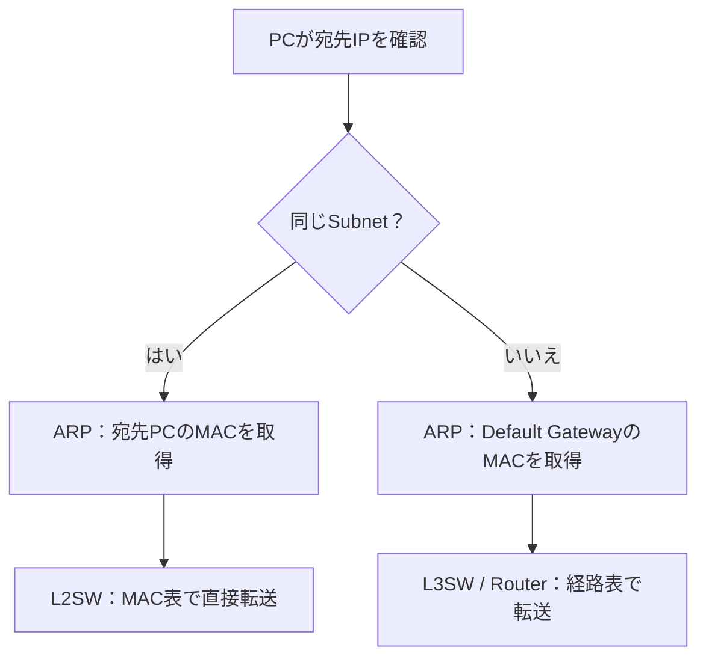

以下を「ネットワーク運用保守・入場前チートシート」の完成版として使えます。重複を統合し、危ない誤解を補正しました 🔧

# 1. AWS資格の知識はどこまで使える？ ☁️➡️🏢

| そのまま活かせる知識 ✅       | AWS資格だけでは不足しやすい知識 ⚠️       |
| ------------------ | -------------------------- |
| IP・CIDR・サブネット      | ケーブル・光・NICなどのL1            |
| ルーティング・最長一致        | MAC・ARP・VLAN・トランク・STP・LACP |
| DNS・DHCP・NAT       | 物理SW・ルーター・FWのCLI           |
| SG・NACL・FWの考え方     | データセンター・ラック・電源・冗長化         |
| VPN・Direct Connect | VMwareなどの仮想化基盤             |
| LB・可用性・冗長化         | SNMP・syslog・パケット解析         |
| ログを使った切り分け         | オンプレサーバー・ネットワーク機器の実運用      |

つまり、

> AWSで学んだL3以上はかなり使える。
> 足すべきなのは、AWSが隠していたL1・L2と機器操作 🔌

---

# 2. AWS・IP・ルーティング基礎 ☁️

| 用語                | 正しい理解                                                     |
| ----------------- | --------------------------------------------------------- |
| `/24`             | CIDRのプレフィックス長。IPv4では256アドレス。AWS subnetでは5個予約され、通常251個利用可能 |
| CIDR重複            | 宛先を一意に判断できない。重複VPC間ではPeeringを作成不可、TGWも正常に経路伝播できない         |
| Public Subnet     | Route TableにIGWへの直接ルートがある                                 |
| Private Subnet    | IGWへの直接ルートがない。必要ならNAT GW経由で外へ出る                           |
| `0.0.0.0/0`       | 全IPv4宛先を表すDestination。Next Hopではない                        |
| Destination       | 「どこ宛てか」                                                   |
| Target / Next Hop | 「次にどこへ渡すか」                                                |
| 最長一致              | 一致する中で、最も長く具体的なプレフィックスを優先                                 |
| SG                | ENI・リソース単位。Stateful                                       |
| NACL              | Subnetへの出入りに適用。Stateless                                  |
| Stateful          | 許可した通信の応答を自動許可                                            |
| ALB               | L7。HTTP/HTTPS、Host・Pathなどで振り分け                            |
| NLB               | L4。TCP・UDP・TLS・QUICなどをIP/Portベースで分配                       |

⚠️ Public Subnetでも、EC2にPublic IP/EIPがなく、SGなどで許可されていなければInternet通信はできません。

[AWS：Route Table](https://docs.aws.amazon.com/vpc/latest/userguide/VPC_Route_Tables.html)・[Public/Private Subnet](https://docs.aws.amazon.com/vpc/latest/userguide/VPC_Internet_Gateway.html)・[SG/NACL](https://docs.aws.amazon.com/vpc/latest/userguide/vpc-network-acls.html)・[ALB/NLB](https://docs.aws.amazon.com/elasticloadbalancing/latest/APIReference/Welcome.html)

---

# 3. VLAN・Subnet・ARPの関係 🏠

## 最重要修正

> ❌ VLAN ＝ Subnet
> ⭕ **VLANとSubnetは別物。ただし通常は1対1で設計する**

| 概念          |      レイヤー | 役割                        |
| ----------- | --------: | ------------------------- |
| VLAN        |        L2 | ブロードキャストが届く部屋を分ける         |
| Subnet/CIDR |        L3 | IPアドレスの範囲を分ける             |
| ARP         | L2とL3の橋渡し | IPv4アドレスから、次に渡す相手のMACを調べる |
| MACアドレステーブル |        L2 | MACアドレスをどのSWポートへ送るか決める    |
| ルーティングテーブル  |        L3 | 宛先CIDRからNext Hopを決める      |

一般的な設計例：

| 用途       |    VLAN | Subnet            | Gateway        |
| -------- | ------: | ----------------- | -------------- |
| 社員PC     | VLAN 10 | `192.168.10.0/24` | `192.168.10.1` |
| サーバー     | VLAN 20 | `192.168.20.0/24` | `192.168.20.1` |
| ゲストWi-Fi | VLAN 30 | `192.168.30.0/24` | `192.168.30.1` |

## 同じSubnetと別Subnetの違い



⭐️絶対暗記：

* 同じSubnet：**宛先PCのMACをARP**
* 別Subnet：**Default GatewayのMACをARP**
* 遠隔サーバーのMACを直接ARPするわけではない
* MACアドレスはルーターを越えるたびに変わる
* IPアドレスは原則そのまま。ただしNATがあれば変わる

1台のSWに複数VLANも、複数SWに同じVLANを通す構成も普通にあります。

[Juniper：VLAN・Access・Trunk・Inter-VLAN Routing](https://www.juniper.net/documentation/us/en/software/junos/multicast-l2/topics/topic-map/bridging-and-vlans.html)

---

# 4. Access・Trunk・Inter-VLAN Routing 🚪

| 用語                 | 役割                                          |
| ------------------ | ------------------------------------------- |
| Access Port        | 原則1つのVLANをPC・プリンターなどへ渡す。通常はタグなし             |
| Trunk Port         | 1本のリンクで複数VLANを運ぶ                            |
| IEEE 802.1Q        | フレームにVLAN IDなどの「荷札」を付ける標準                   |
| Inter-VLAN Routing | 異なるVLAN間をL3SW・ルーターで転送                       |
| SVI                | L3SW上に作るVLANごとの仮想L3インターフェース。Gatewayになることが多い |

⚠️ APの接続ポートは、複数SSIDを別VLANへ分ける場合、AccessではなくTrunkになることがあります。

昔のCisco独自方式「ISL」はレガシーです。現在の基本は**802.1Q**です。[Cisco：802.1Q Trunk](https://www.cisco.com/c/en/us/support/docs/switches/catalyst-6000-series-switches/10599-88.html)

---

# 5. 機器とレイヤー 🏢

典型的な流れ：

> 無線PC → AP → Access SW
> 有線PC → Access SW
> その後 → L3SW → FW → Edge Router/ISP → Internet

| 機器         |      主なレイヤー | 役割                           |
| ---------- | ----------: | ---------------------------- |
| AP         |        L2中心 | Wi-Fi端末を有線LANへ橋渡し            |
| Access SW  |        L2中心 | PC・AP・電話・プリンターをVLANへ収容       |
| Core/L3 SW |       L2/L3 | SW集約、VLAN間ルーティング             |
| Router     |          L3 | WAN・他拠点・ISP・別ネットワークへ転送       |
| Firewall   | L3/L4＋セッション | IP・Port・通信状態を基に許可・拒否         |
| NGFW       |       L3～L7 | アプリ識別、URL、IPSなども検査           |
| WAF        |          L7 | HTTP/HTTPSを検査し、SQLi・XSSなどを防ぐ |
| LB         |     L4またはL7 | 複数サーバーへ通信を分配                 |

🧠例えると：

* L2SW：同じフロアの内線係 ☎️
* L3SW：社内のフロア間エレベーター 🛗
* Router：社外へ出る高速道路の入口 🛣️
* Firewall：警備員 👮
* WAF：Web申請書の中身を確認する受付係 📄

⚠️ L3SWとRouterはどちらもRoutingできます。違いは絶対ではなく、主に「LAN内部向けか、WAN・外部接続向けか」という役割です。

現代の大規模環境ではEVPN/VXLANやL3 Accessもありますが、まず上記のクラシック構成を理解すれば足切りは回避できます。

[AWS：WAF](https://docs.aws.amazon.com/waf/latest/developerguide/what-is-aws-waf.html)

---

# 6. AWSの接続方式 ☁️🔗

| 方式                 | 何と何をつなぐ？           | 使い所                                    |
| ------------------ | ------------------ | -------------------------------------- |
| VPC Peering        | VPC ↔ VPC          | 少数・1対1。推移ルーティングなし。CIDR重複不可             |
| Transit Gateway    | 多数のVPC・VPN・DX      | 中央ルーター。TGW自体はRegional                  |
| Site-to-Site VPN   | オンプレNW ↔ VGW/TGW   | Internet上のIPsecトンネル。通常2トンネル            |
| Client VPN         | 個人端末 ↔ AWS/オンプレ資源  | リモートアクセス。TLS/OpenVPNベース                |
| Direct Connect     | オンプレ ↔ AWS Network | 専用接続。安定性・帯域重視                          |
| PrivateLink        | 利用者VPC → 特定サービス    | VPC全体ではなく、必要なサービスだけ公開                  |
| Interface Endpoint | 利用者側SubnetにENIを作成  | PrivateLinkを利用する入口                     |
| Gateway Endpoint   | VPC → S3/DynamoDB  | Route TableへAWS管理のPrefix List Routeを追加 |

## 補正ポイント ⚠️

* PrivateLinkはAWSサービスだけでなく、SaaSや独自のEndpoint Serviceにも使える
* Interface Endpointは、選択したSubnetにPrivate IP付きENIを作る
* Gateway Endpointは**PrivateLinkを使用しない**
* Gateway Endpoint対象は**S3・DynamoDBのみ**
* S3・DynamoDBはInterface Endpointも選択可能
* Gateway Endpoint自体には追加料金なし
* Interface Endpointは時間・データ処理料金あり
* Direct Connectは**標準では暗号化されない**。必要ならMACsecやVPN over DXを使う

[AWS：PrivateLink/Interface Endpoint](https://docs.aws.amazon.com/vpc/latest/privatelink/create-interface-endpoint.html)・[Gateway Endpoint](https://docs.aws.amazon.com/vpc/latest/privatelink/gateway-endpoints.html)・[Site-to-Site VPN](https://docs.aws.amazon.com/vpn/latest/s2svpn/VPC_VPN.html)・[Direct Connectの暗号化](https://docs.aws.amazon.com/directconnect/latest/UserGuide/encryption-in-transit.html)

---

# 7. 名前・アドレス・監視・経路交換 📡

| 用語          | 一言でいうと                            |
| ----------- | --------------------------------- |
| ARP         | IPv4 → 同一L2上の次Hop MAC             |
| NDP         | IPv6でARP相当＋Router探索など             |
| DNS         | 名前 → DNSレコード。A/AAAAレコードならIP       |
| DHCP        | IP・Subnet Mask・Gateway・DNSなどを払い出す |
| NAT/PAT     | IPやPortを書き換える。Private↔Globalが代表例  |
| MAC Table   | MAC＋VLAN → SW Port                |
| Route Table | 宛先CIDR → Next Hop                 |
| NTP         | 機器・サーバーの時計合わせ                     |
| syslog      | 障害・認証・設定変更などのイベントログ               |
| SNMP        | CPU・帯域・Interface状態を取得。Trap通知も可能   |
| OSPF        | 1つの組織・AS内部で経路を自動交換するIGP           |
| BGP         | 主に異なるAS間で、ポリシーを含めて経路交換            |

⚠️次の理解は「基本形」であって絶対ではありません。

> 社内＝OSPF、社外＝BGP

BGPには組織内部で使う**iBGP**もあります。大規模企業・データセンター・クラウド内部でも使われます。[Juniper：OSPF](https://www.juniper.net/documentation/us/en/software/junos/ospf/topics/topic-map/ospf-overview.html)・[BGP](https://www.juniper.net/documentation/us/en/software/junos/bgp/topics/topic-map/bgp-overview.html)

SNMP/syslogは現在も現役ですが、モダン環境ではAPI・Streaming Telemetry・gNMIなども併用されます。

---

# 8. 認証：RADIUSとTACACS+ 🔐

| 方式      | 典型用途                               |
| ------- | ---------------------------------- |
| RADIUS  | 社員・端末のLAN/Wi-Fi/VPN接続認証。802.1Xなど   |
| TACACS+ | Router・SW・FWへログインする管理者認証、コマンド単位の認可 |

どちらもAAAを扱います。

* Authentication：誰か
* Authorization：何をしてよいか
* Accounting：何をしたか

⚠️ RADIUSも機器管理に使用可能です。「RADIUSは社員だけ、TACACS+は管理者だけ」と完全に固定されているわけではありません。

AD DSとはNPSなどを介して連携できます。Entra IDとの連携方法は製品・構成依存です。[Microsoft：NPS/RADIUS](https://learn.microsoft.com/en-us/windows-server/networking/technologies/nps/nps-top)・[Cisco：RADIUSとTACACS+](https://www.cisco.com/c/en/us/support/docs/security-vpn/remote-authentication-dial-user-service-radius/13838-10.html)

---

# 9. TCP 3-way Handshake 🤝

```text
Client → SYN
Server → SYN/ACK
Client → ACK
```

* SYN：接続開始・シーケンス番号同期
* SYN/ACK：受信確認＋相手側も同期
* ACK：最終確認
* RST：接続拒否・異常終了。Handshakeの一部ではない

---

# 10. 障害切り分けの順番 🔥

| 確認      | Windows / Linux例                                   | 分かること               |
| ------- | -------------------------------------------------- | ------------------- |
| 自端末設定   | `ipconfig /all` / `ip addr`                        | IP・Mask・Gateway・DNS |
| 名前解決    | `Resolve-DnsName` / `dig`                          | DNS問い合わせが成功するか      |
| ICMP    | `ping`                                             | ICMPの往復だけ           |
| 経路      | `tracert` / `traceroute`                           | どこまで進むか             |
| TCP/443 | `Test-NetConnection -Port 443` / `nc -vz host 443` | TCP接続できるか           |
| HTTPS   | `curl -v https://...`                              | TLS・証明書・HTTP・アプリ応答  |

## 判定の補正 ⚠️

### Hostname指定のpingが成功

名前解決は成功しています。ただし、参照元がDNSとは限りません。

* DNS
* キャッシュ
* `hosts`ファイル

を確認するには、`Resolve-DnsName`や`dig`を使用します。

### TCP/443接続失敗

「FWが原因」とはまだ断定できません。

* Route
* FW・SG・NACL
* サーバー停止
* 443でLISTENしていない
* Proxy
* 戻り経路

なども候補です。

### TCP成功、HTTPS失敗

* TLSバージョン
* 証明書
* SNI
* Proxy
* Webサーバー・アプリ
* 認証・HTTP設定

を確認します。

[Microsoft：Resolve-DnsName](https://learn.microsoft.com/en-us/powershell/module/dnsclient/resolve-dnsname?view=windowsserver2025-ps)・[Test-NetConnection](https://learn.microsoft.com/en-us/powershell/module/nettcpip/test-netconnection?view=windowsserver2025-ps)

---

## 最終暗記セット 🎯

> 🟦 VLAN＝L2の部屋分け
> 🟩 CIDR/Subnet＝L3の住所範囲
> 🔎 ARP＝次に渡す相手のMACを探す
> 📒 MAC Table＝L2の出口ポートを決める
> 🗺️ Route Table＝L3のNext Hopを決める
> 🚪 Default Gateway＝別Subnetへの出口
> 👮 FW＝通してよい通信か判断
> 🔄 NAT＝IP・Portを書き換える
> ⚖️ LB＝複数サーバーへ分配
> 🌐 DNS＝名前をレコードへ解決

⭐️最重要はこれです。

> **同じSubnetなら宛先MACへ送る。
> 別SubnetならDefault GatewayのMACへ送る。**

出典は2026年8月30日時点のAWS・Microsoft・Juniper・Cisco公式を確認しています。
2024年より前の一次資料として、現行の基礎規格である[ARP：RFC 826（1982年）](https://www.rfc-editor.org/rfc/rfc826.html)、[IPv6 NDP：RFC 4861（2007年）](https://www.rfc-editor.org/rfc/rfc4861.html)、[TCP：RFC 9293（2022年）](https://www.rfc-editor.org/rfc/rfc9293.html)も参照しています。公開日は古いですが、廃止技術ではなく現在の基礎仕様です。
